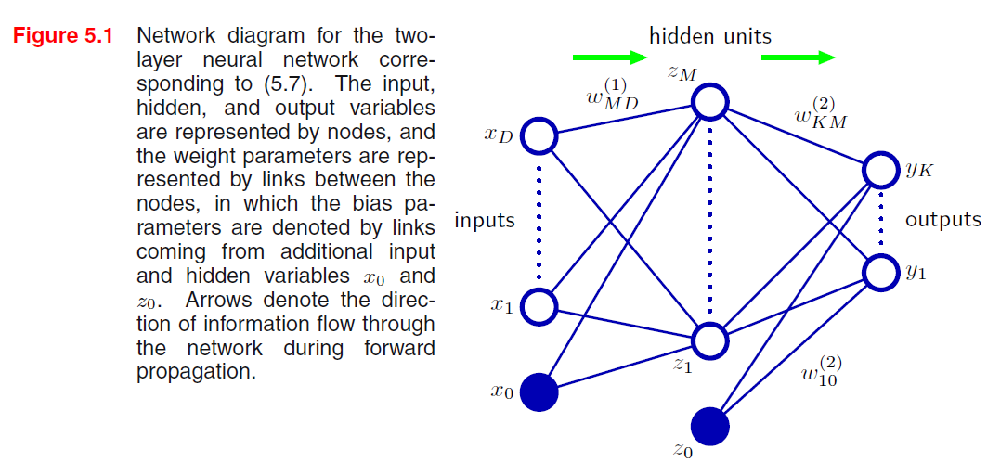

## Modelling

The linear models for regression and classification are based on linear combinations of mixed nonlinear basis functions $\phi_j(x)$ and of the form,
$$
y(\textbf{x}, \textbf{w}) = f\Big( \sum_{j=1}^M w_j \phi_j(x) \Big)
$$
where $f(\cdot)$ is a nonlinear activation function.
The model can be extended and adapted to a neural network model if
- the basis function $\phi_j(x)$ depends on parameters,
- and those parameters are able to be adjusted along with the coefficients $w_j$ during training.
$$
a_j = \sum_{i=1}^D w_{ji}^{(1)}x_i + w_{j0}^{(1)}
$$
where $j = 1,\dots,M$, and the superscript $^{(1)}$ indicates that corresponding parameters are in the first "layer" of the network. The parameters $w_{ji}^{(1)}$ and $w_{j0}^{1}$ refer to *weights* and *biases* respectively. The quantities $a_j$ are known as activations, each of which is then transformed using a differentiable, nonlinear *activation function $h(\cdot)$* to give
$$
z_j = h(a_j).
$$
In the context of neural networks, these quantities (i.e., $z_j$) are called *hidden units*. The differentiable, nonlinear activation function $h(\cdot)$ normally chosen from sigmoid, tanh and etc. The resulting $z_j$ becomes the input of the next layer.
$$
a_k = \sum_{j=1}^M w_{kj}^{(2)}z_j + w_{k0}^{(2)}
$$

> [!NOTE]
> 
> The terminology of layer might be confusing in different contexts. Someone might determine the number of layers simply by counting the number of layers of units (1 input layer + 1 hidden layer + 1 output layer in the above example) as a 3-layer network or single-hidden-layer network.
> 
>  The terminology "layer" used here and in the following contents is referring to the number of layers of adaptive weights (input-to-hidden counts 1 series of weights, plus hidden-to-output gives 2 series of weights in total) as a 2-layer network.

Finally, the output unit activation are transformed using an appropriate activation function to give a set of network outputs $y_k$. **The choice of activation function is determined by the nature of the data and the assumed distribution of target variables.**

> [!QUESTION] How the activation function is doing to the input?
> Activation functions introduce the nonlinearity into the network so that the network is able to approximate any complex continuous functions. Read more about [[Universal Approximation Theorem|MLPs are universal function approximators]].

$$
y_k = \sigma(a_k)
$$
where
$$
\sigma(a) = \dfrac{1}{1 + exp(-a)}
$$
To sum up, the network function is derived by combining previous stages and takes the form
$$
y_k(\textbf{x},\textbf{w}) = \sigma\left( \sum_{j=1}^Mw_{kj}^{(2)}h\left(\sum_{i=1}^{D}w_{ji}^{(1)}+w_{j0}^{(1)}\right)+w_{k0}^{(2)}\right)
$$
where the set of all weight and bias parameters are grouped together into a vector $w$,
$$
w_k = 
\begin{bmatrix}
bias\\
w_1\\
w_2\\
\vdots\\
w_M
\end{bmatrix}.
$$
Why is that? In order to compact the form of $a_j$, the bias parameter can be grouped together with weight parameters as long as there is a supplementary input where $x_0 = 1$, and hence,
$$
\begin{equation}
\begin{split}
a_j &= \sum_{i=1}^M w_{ji}^{(1)} + w_{j0}^{(1)}\\
&= \sum_{i=1}^M w_{ji}^{(1)} + w_{j0}^{(1)} \cdot 1\\
&= \sum_{i=0}^M w_{ji}^{(1)}.
\end{split}
\end{equation}
$$
It also does the trick on the second layer so that the output $y_k$ becomes
$$
y_k(\textbf{x},\textbf{w})=\sigma\left(\sum_{j=0}^Mw_{kj}^{(2)}h\left(\sum_{i=0}^Dw_{ji}^{(1)}x_i\right)\right)
$$
The process of of evaluating can be interpreted as a *forward propagation* of information through the network.

> [!IMPORTANT]
> One of the key difference between perceptron and multilayer perceptron (MLP) is that the neural network uses continuous sigmoidal nonlinearities in the hidden units, whereas the perceptron uses step-function nonlinearities. Therefore, the neural network function is differentiable with respect to the network parameters.

## Training
In addition to regression problems, neural network also considers the probability of the group truth given by input vectors $\{\textbf{x}\}$ and adaptive weights $\{\textbf{w}\}$ and takes the form (assuming that $t$ has a Gaussian distribution with an $\textbf{x}$-dependent mean),
$$
p(t|\textbf{x},\textbf{w})=\mathcal{N}(t|y(\textbf{x},\textbf{w}), \beta^{-1})
$$
where $\beta$ is the precision of the Gaussian noise (i.e., inverse variance $\sigma^2=\beta^{-1}$). Given a data set of $N$ independent, identically distributed observations $\textbf{X}=\{x_1,\ldots,x_N\}$, along with corresponding truth values $\textbf{t} = \{t_1,\ldots,t_N\}$, we can construct the likelihood function
$$
p(\textbf{t}|\textbf{X},\textbf{w},\beta) = \prod_{n=1}^Np(t_n|\textbf{x}_n,\textbf{w}, \beta)
$$
Our goal to maximize the likelihood function is the equivalent to minimizing the negative likelihood function, and by taking the negative logarithm, we obtain
$$
\begin{equation}
\begin{split}
p(\textbf{t}|\textbf{X},\textbf{w},\beta) &= \prod_{n=1}^Np(t_n|\textbf{x}_n,\textbf{w}, \beta)\\
&= \prod_{n=1}^N\dfrac{1}{2\pi}\beta^{\frac{1}{2}}e^{-\frac{1}{2}\beta(y(\textbf{x}_n,\textbf{w} - \textbf{t}_n)^2)}\\
-\ln(p(\textbf{t}|\textbf{X},\textbf{w},\beta)) &= - \left(-\frac{N}{2}\ln(2\pi)+\frac{N}{2}\ln\beta+\ln\left(-\frac{\beta}{2}\sum_{n=1}^N(y(\textbf{x}_n,\textbf{w})-\textbf{t}_n)^2\right)\right)\\
&= \frac{\beta}{2}\ln\sum_{n=1}^N(y(\textbf{x}_n,\textbf{w})-\textbf{t}_n)^2+\frac{N}{2}\ln(2\pi)-\frac{N}{2}\ln\beta
\end{split}
\end{equation}
$$
Given a training set comprising a set of input vectors $\{\textbf{x}_n\}$, where $n=1,\ldots,N$, together with a corresponding set of target vectors $\{\textbf{t}_n\}$, we minimize a sum-of-squares error function
$$
E(\textbf{w})=\dfrac{1}{2}\sum_{n=1}^N ||y(\textbf{x}_n, \textbf{w})-\textbf{t}_n||^2.
$$
where additive (i.e., $\frac{2}{N}\ln(2\pi)$ and $\frac{2}{N}\ln\beta$) and multiplicative (i.e., $\frac{\beta}{2}$) constants are discarded.
We have the estimation of $\beta$ by taking the partial derivative of ...
$$
\begin{equation}
\begin{split}
\frac{\partial f}{\partial \beta} &= \frac{\partial\left(\frac{\beta}{2}\ln\sum_{n=1}^N(y(\textbf{x}_n,\textbf{w})-\textbf{t}_n)^2+\frac{N}{2}\ln(2\pi)-\frac{N}{2}\ln\beta\right)}{\partial \beta}\\
&= \frac{1}{2}\ln\sum_{n=1}^N(y(\textbf{x}_n,\textbf{w})-\textbf{t}_n)^2 - \frac{N}{2 \beta}
\end{split}
\end{equation}
$$
Let above equal to 0,
$$
\frac{1}{\beta} = \frac{1}{N}\ln\sum_{n=1}^N(y(\textbf{x}_n,\textbf{w})-\textbf{t}_n)^2
$$