[[Updated on 07-02-2024: add a few new functions in ReLU family]](#silu)

In the context of perceptron models, the activation function normally refers to a thresholding function that activates an neuron given specific input. As for deep neural networks, the activation function is a nonlinear (and differentiable if applying gradient-based optimization) function that extends nonlinearity to the neural network across hidden layers, and hence a network is able to approximate complex functions.

## Why Nonlinear Activation Function

Despite that the [[Universal Approximation Theorem]] requires a nonlinear activation function to be held, a linear one does not strengthen the ability of approximation when increasing the depth of neural networks. 

###  Proof
Consider a linear activation function $h(\cdot)$ given by,

$$
h(x) = k \cdot x, \quad \text{where } k \in \mathcal{R}
$$

And the output of an arbitrary layer is,

$$
\begin{align}
&a^{(L)} = h(w^{(L)}a^{(L-1)}+b^{(L)})\\
\end{align}
$$


After expanding, we get,


$$
\begin{align}
a^{(L)} &= k(w^{(L)}a^{(L-1)}+b^{(L)})\\
&= k(w^{(L)}(k(w^{(L-1)}a^{(L-2)}+b^{(L-1)}))+b^{(L)})\\
&= k(w^{(L)}(k(w^{(L-1)}(\ldots (k(w^{(1)}x+b^{(1)})\ldots)+b^{(L-1)}))+b^{(L)})\\
&= cw^\prime x + b^\prime \quad (\text{where } c \in \mathcal{R})
\end{align}
$$


Consequently, neural networks applied with linear activation functions could only solve linear separable problems.

## Categories

The three most common categories for activation functions are,

### Ridge Functions

Ridge functions are multivariate functions acting on a linear combination of input variables with some affine transformations.
- Linear
- ReLU
- Heaviside (Unit Step Function)
- Sigmoid (or Logistic)

##### Radial Based Functions (or RBF)

Radial functions

### Fold Functions

Fold functions are usually used in the pooling layers and performing aggregation over the inputs, such as taking the mean, minimum or maximum.
- `AvgPoolND`
- `MinPoolND`
- `MaxPoolND`

There are also saturating functions and non-saturating functions

###  Saturating Functions

Saturating functions are activation functions whose first-order derivative approaches to zero when $x$ goes to positive and negative infinity, i.e.,


$$
\lim_{|x|\rightarrow\infty}|\nabla f(x)|=0
$$


- Sigmoidal functions
- Hyperbolic tangent functions

Saturating functions are mostly likely to suffer from [[#Vanishing Gradient]] problem.

> [!note]
> In the following contexts, saturating functions are specifically referring to activation functions that are saturating functions.

### Non-saturating Functions

Non-saturating functions are activation functions that are not saturating.
    - ReLU functions

## ReLU Functions

### ReLU


$$
\text{ReLU}(x) = (x)^+ = \max(0,x)
$$

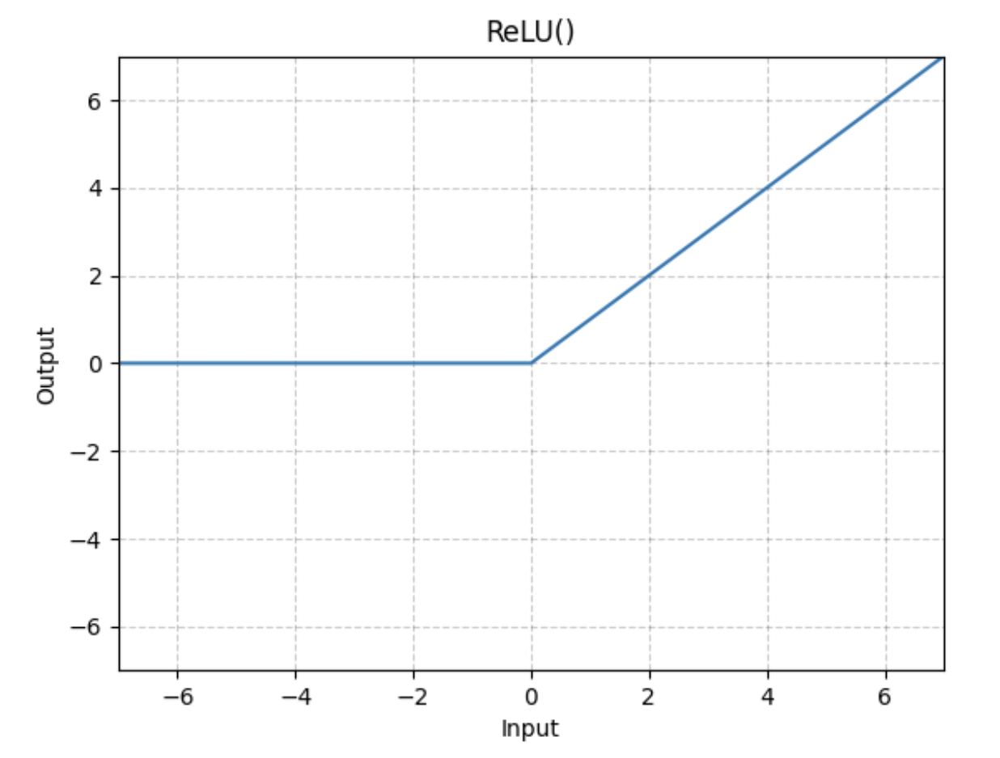

###  RReLU

$$
\text{RReLU}(x) = 
\begin{cases}
    x, & \text{if } x \ge 0\\
    ax, & \text{otherwise}
\end{cases}
$$

where $a$ is randomly sampled from uniform distribution $\mathcal{U}\text{(lower, upper)}$.

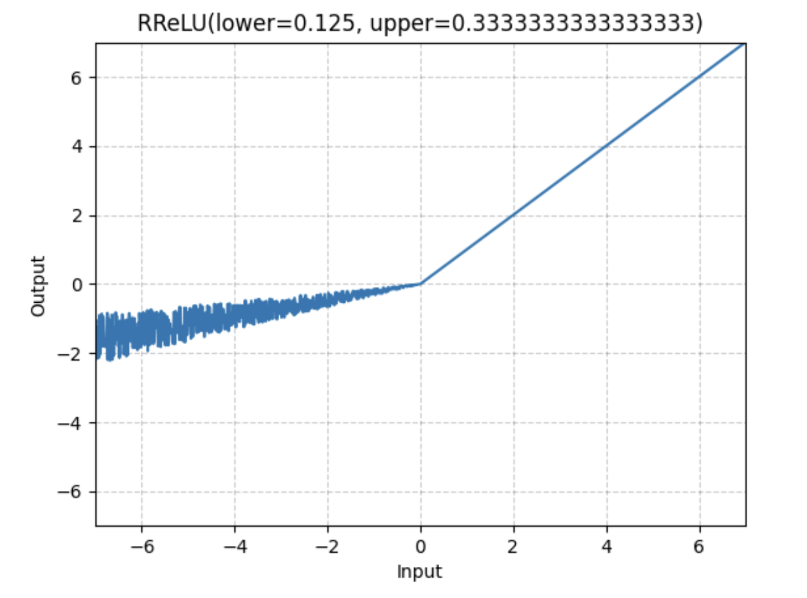

### ReLU6


$$
\text{ReLU6}(x) = \min(\max(x_0, x), q(6))
$$


where $x_0$ is the zero_point, and $q(6)$ is the quantized representation of number 6.

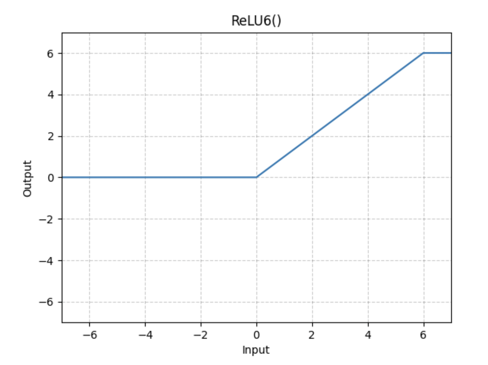

### LeakyReLU


$$
\text{LeakyReLU}(x) = 
\begin{cases}
    x, & \text{if } x \ge 0\\
    \text{negative\_slope}\cdot x, & \text{otherwise}
\end{cases}
$$


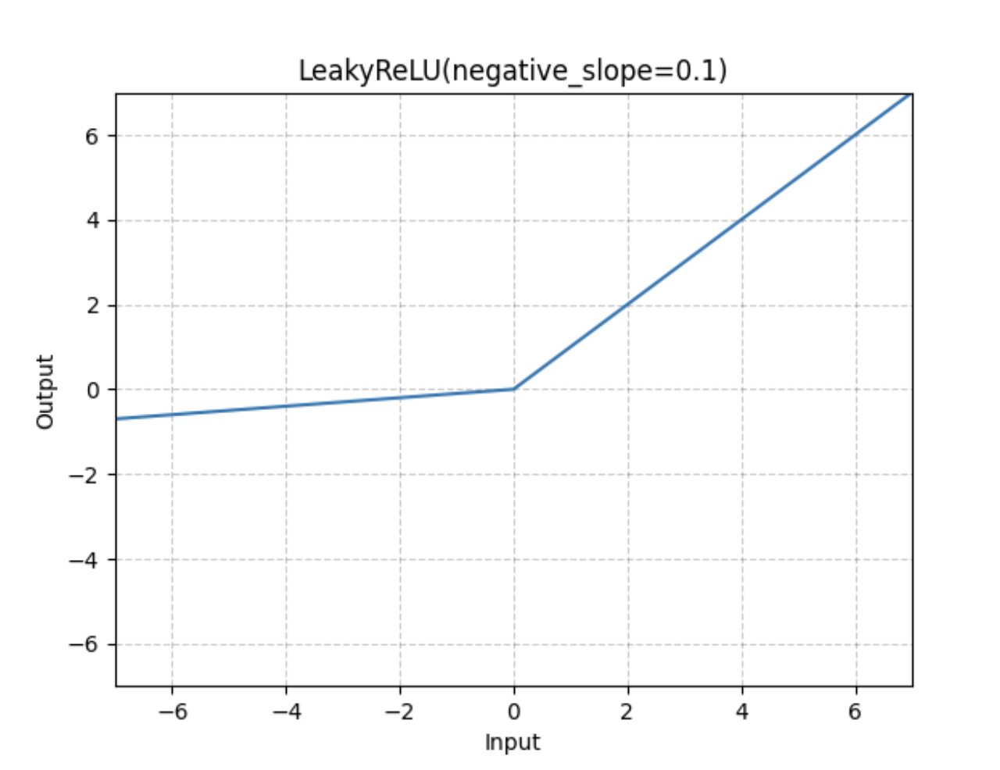

### ELU


$$
\text{ELU}(x) =
\begin{cases}
    x, & \text{if } x > 0\\
    \alpha(\exp(x)-1), & \text{if } x \le 0
\end{cases}
$$

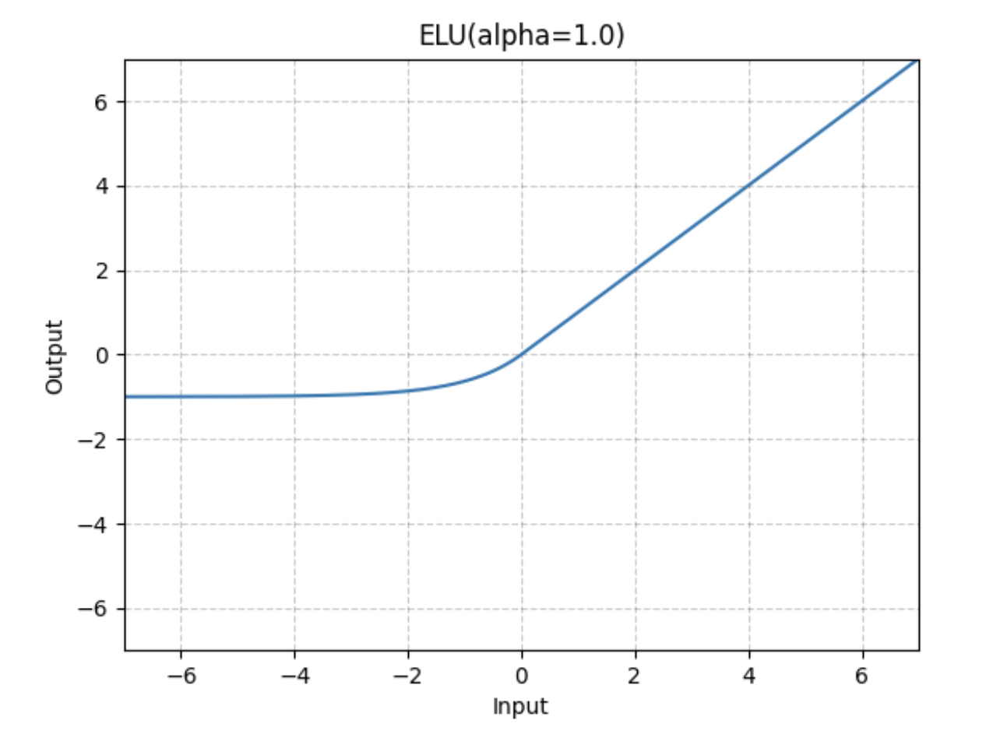

### SiLU

Sigmoid Linear Unit, or SiLU, is computed by the sigmoid function multiplied by its input.

$$
\mathrm{SiLU}=x\sigma(x)
$$

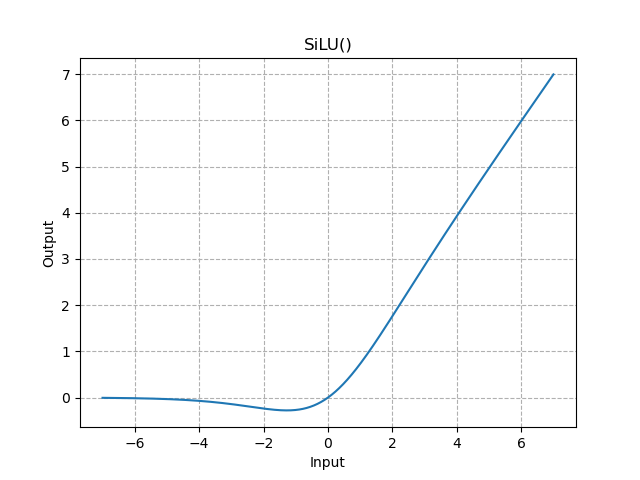

### SELU

Scaled Exponential Linear Unit, or SELU, includes self-normalizing properties and it is defined by,

$$
\mathrm{SELU}=
\begin{cases}
\lambda x, & \text{if } x \ge 0\\
\lambda\alpha (\exp(x)-1), & \text{otherwise}
\end{cases}
$$

where $\alpha \approx 1.6733$ and $\lambda \approx 1.0507$.

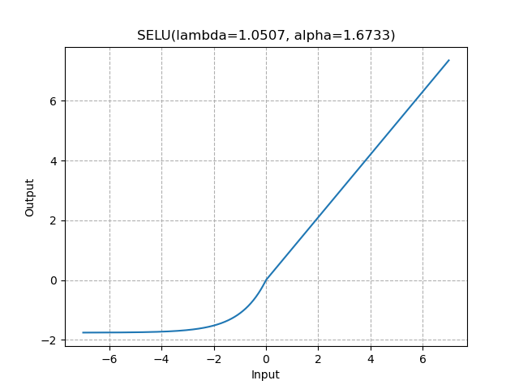

### GELU

Gaussian Error Linear Unit, or GELU, is computed by $x\Phi(x)$, where $\Phi(x)$ is the standard Gaussian cumulative distribution function (CDF). GELU alleviates vanishing gradients by weighting inputs with their percentile rather than simply gating inputs by their sign as in ReLU.

$$
\mathrm{GELU}(x)= xP(X\le x) = x\Phi(x) = x\cdot \frac{1}{2}\left[1+\mathrm{erf}(x/\sqrt{2})\right],
$$

where $X \sim \mathcal{N}(0,1)$.

> [!note]
> GELU can be approximated with,
>  - $0.5x\left(1+\tanh\left[\sqrt{2\pi}(x+0.44715x^3)\right]\right)$,
>  - $x\sigma(1.702x)$, where $x\sigma(x)$ is SiLU.

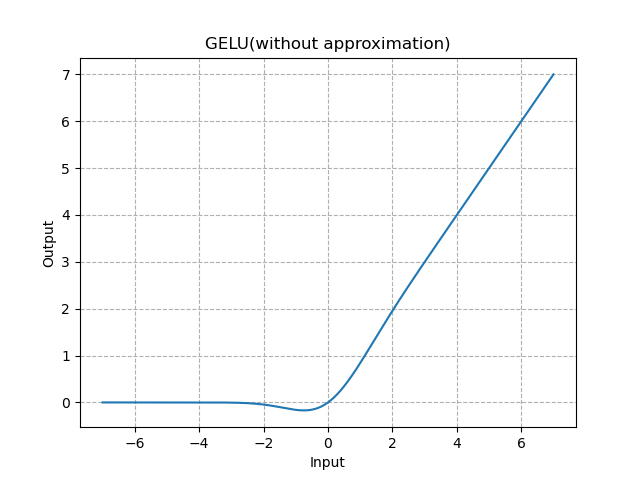


### Summary

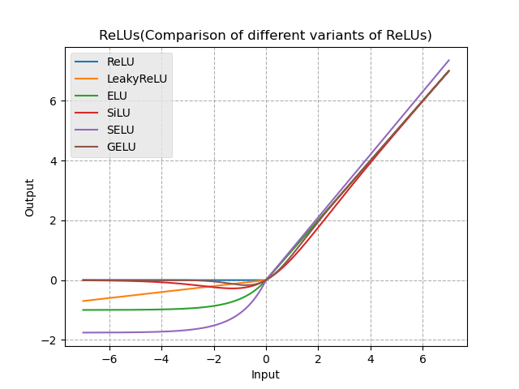


## Sigmoidal Functions

### Sigmoid


$$
\text{Sigmoid}(x) = \sigma(x) = \frac{1}{1+e^{-x}} = \frac{e^x}{e^x+1}
$$


```python
y = np.exp(x)
return y / (1 + y)
```

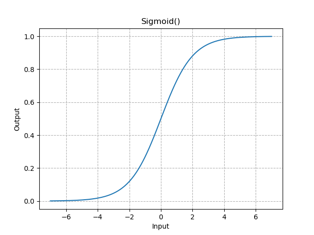

### UltraFastSigmoid
UltraFastSigmoid approximates Sigmoid function by splitting it into three segments.

```python
def fast_sigmoid(x):
    # borrowed from Theano
    x = 0.5 * x  
    # The if is a tanh approximate.  
    if x >= 0:  
        if x < 1.7:  
            z = (1.5 * x / (1 + x))  
        elif x < 3:  
            z = (0.935409070603099 + 0.0458812946797165 * (x - 1.7))  
        else:  
            z = 0.99505475368673  
    else:  
        xx = -x  
        if xx < 1.7:  
            z = (1.5 * xx / (1 + xx))  
        elif xx < 3:  
            z = (0.935409070603099 + 0.0458812946797165 * (xx - 1.7))  
        else:  
            z = 0.99505475368673  
        z = -z  
  
    return 0.5 * (z + 1.)
```

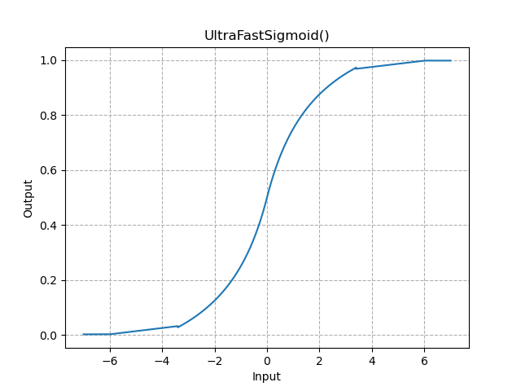

### Hardsigmoid

$$
\text{Hardsigmoid} =
\begin{dcases}
    0, & \text{if } x \le -3\\
    1, & \text{if } x \ge +3\\
    x/6+1/2 & \text{otherwise}
\end{dcases}
$$

```python
y = np.clip(x / 6 + 0.5, 0.0, 1.0)
# or even more aggresively approximate
y = np.clip(x * 0.2 + 0.5, 0.0, 1.0)
return y
```

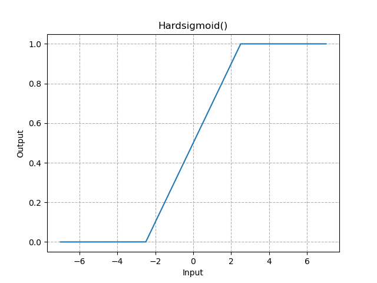

> [!tip]
> Without involving exponential operations, Hardsigmoid apparently is faster than UltraFastSigmoid, let alone original Sigmoid. But be aware of the fact that the former is also much more approximate than the later, which also introduces more errors. Hence, Hardsigmoid is probably not your best option, when you are in an error-prune situation.
>
> 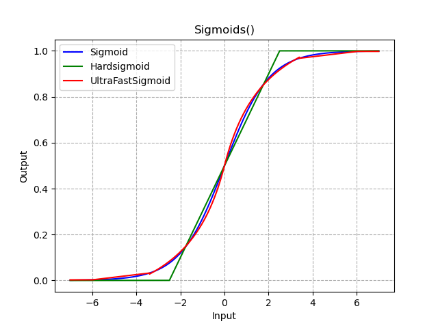


## Hyperbolic Tangent


### Hyperbolic tangent (tanh)


$$
\text{Tanh}(x) = \text{tanh}(x) = \dfrac{e^x-e^{-x}}{e^x+e^{-x}} = 1-\dfrac{2e^{-x}}{e^x+e^{-x}}
$$


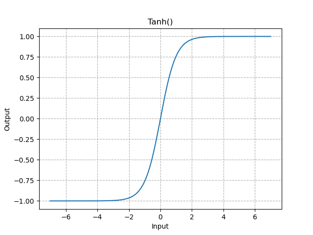
    

### HardTanh

$$
\text{HardTanh}(x) = 
\begin{cases}
    \text{max\_val}, & \text{if } x > \text{ max\_val}\\
    \text{min\_val}, & \text{if } x < \text{ min\_val}\\
    x, & \text{otherwise}
\end{cases}
$$


```python
def HardTanh(x, min_val=-1.0, max_val=1.0):
    return np.clip(x, min_val, max_val)
```

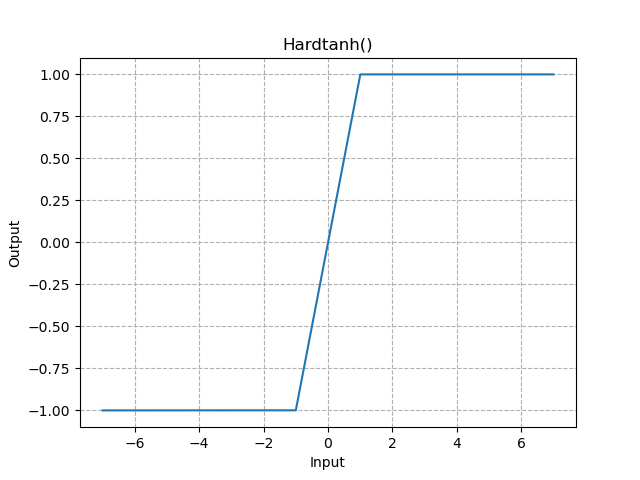

### Softmax


$$
\text{Softmax}(x_i) = \dfrac{e^{x_i}}{\sum_je^{x_j}}
$$


when the input tensor is a sparse tensor, the unspecified values are treated as `-inf`.

### LogSoftmax


$$
\text{LogSoftmax}(x_i) = \log \text{Softmax}(x_i) = \log\left(\dfrac{e^{x_i}}{\sum_j e^{x_j}}\right)
$$


### Softmax2d

Applies Softmax over features to each spatial location.

## Problems

### Vanishing Gradient

The vanishing gradient problem is most likely to occur to the gradient based method with a [[#Saturating Functions|saturating activation function]]. 
The output of a deep feedforward neural network in an arbitrary layer is a combination of function composition, i.e.,


$$
\begin{align}
z^{(L)} &= h\left( w^{(L)}z^{(L-1)} \right)\\
&= h \left( w^{(L)}h\left( w^{(L-1)}z^{(L-2)} \right) \right)\\
&= h \left( w^{(L)} h \left( w^{(L-1)}\cdots h\left(w^{(1)}x\right) \right) \right),
\end{align}
$$


where $w$ and the superscript $(L)$ are the weights of parameters in corresponding layer, and $h(\cdot)$ denotes an activation function.

> [!info] Omit the bias term $b$ for simplicity.

During backpropagation with gradient descent, the weights of parameters is updated by the chain rule, i.e.,


$$
\begin{align}
\nabla z^{(L)} = \dfrac{\partial z^{(L)}}{\partial w^{(L)}}
\end{align}
$$


When output is large, the activation unit is close to the boundary $0$ and $1$, and sigmoidal functions saturates. Meanwhile, the product of fractional gradients across multiple layers accumulates to be nearly zero. Thus, gradients vanished and learning seemed to stop.

It can be concluded that a vanishing gradient problem is mainly caused by three reasons:


- Saturate. The nature of saturating functions is that they saturate and kill the gradients with large output, i.e., 

  $$\lim_{|x|\rightarrow\infty}|\nabla f(x)|=0$$

- Additionally, the gradients of excessive saturation multiplying across layers yet still stops the learning process as backpropagation stops updating weights of parameters, i.e., $\Delta_w^{(1)} \approx 0$.

- Overfitting. The neural network model might be overfitting with learning some statistical noises. Consequently, some weights of parameters are particularly larger than others, which potentially results in large output and becomes excessive saturation.

#### Solution 0. Use Sigmoid Function In One Layer

As the second cause stated that the gradient vanishes when multiplying across multiple layers with saturating functions, one of the intuitive fix is placing saturating functions only in the last layer. So that the product of a single fractional gradient and others lying in sane ranges will not become a smaller number during backpropagation.

#### Solution 1. Replace with tanh

Hyperbolic tangent function can be regarded as a scaled sigmoid function with zero centered, i.e.,


$$
\begin{align}
\text{tanh}(x) &= \dfrac{e^x-e^{-x}}{e^x+e^{-x}}\\
&= 1 - \dfrac{2}{e^{2x}+1}\\
&= 2\sigma(2x)-1
\end{align}
$$


As a result, the derivative of $\text{tanh}(x)$ also scaled up at least twice. In other words, it is also has the twice tolerance as sigmoid function does.

#### Solution 2. Weight Initialization/Normalization

Towards this solution, weight initialization (and other normalization methods) address the third cause of a vanishing gradient problem. It essentially maintain a manageable covariance of weights among layers, and hence lowers the possibility of getting large output.

#### Solution 3. ReLU Functions

Instead of saturating functions, placing the family of ReLU functions in the activation unit prevent vanishing gradients once for all. However, introducing ReLU functions also comes along with their own constraints and vulnerabilities.

#### Solution 4. Residual Blocks

### Exploding Gradient

In contrast to the [[#Vanishing Gradient]] problem, the exploding gradient problem refers to the significant increase in the gradient during backpropagation.

#### Solution 1. Gradient Clipping

#### Solution 2. Weight Initialization

#### Solution 3. Normalization

### Dying ReLU

A dying ReLU problem normally refers to the model, $b^{(L)} >\\!\\!> \sum w^{(L)}z^{(L-1)}$, which learned a large bias resulting in a negative output, $z^{(L)} < 0$. Additionally, ReLU function maps the negative value to 0. As a result, that neuron dies and always output the same value 0.

[A more comprehensive answer](https://datascience.stackexchange.com/a/5734)


## Appendix

The plots are available with `numpy` and `matplotlib`.



