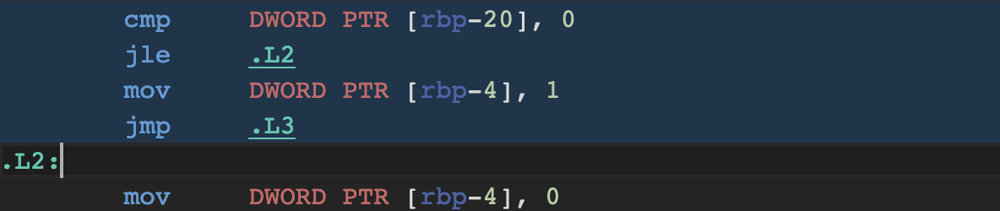
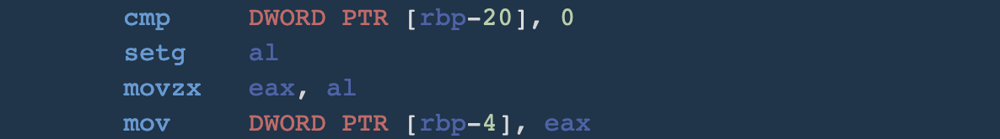
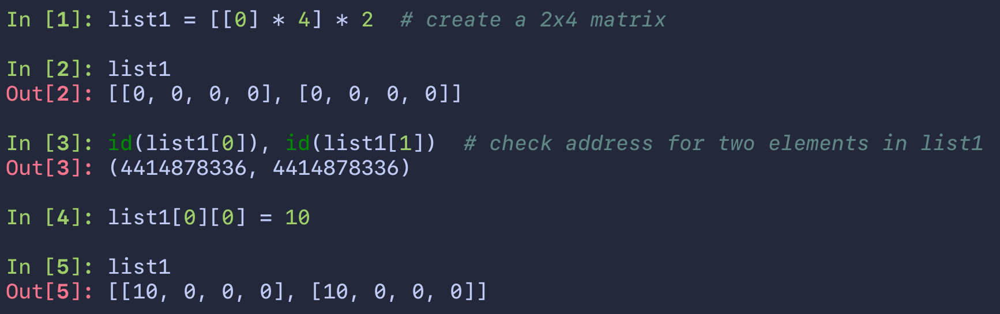

# Optimization Techniques

- [Branch Prediction](#branch-prediction)


## Branch Prediction

[Why is processing a sorted array faster than processing an unsorted array?](https://stackoverflow.com/a/11227902)


### Example: Random Access vs. Ordered Access

```c
#include <stdio.h>
#include <stdlib.h>
#include <time.h>

#define ARRAY_SIZE 100000000

int main() {
    static int data[ARRAY_SIZE];

    for (int i = 0; i < ARRAY_SIZE; ++i) {
        data[i] = rand() % 256;
    }

    long long sums = 0;
    clock_t tic = clock();
    // Snippet 1: random access
    for (int i = 0; i < ARRAY_SIZE; ++i) {
        if (data[i] > 128) {
            sums += data[i];
        }
    }
    clock_t toc = clock();
    printf("Random access took %lf seconds\n", (double)(toc - tic)/CLOCKS_PER_SEC);

    for (int i = 0; i < ARRAY_SIZE; ++i) {
        data[i] = i;
    }
    sums = 0;
    tic = clock();
    // Snippet 2: ordered access
    for (int i = 0; i < ARRAY_SIZE; ++i) {
        if (data[i] > 128) {
            sums += data[i];
        }
    }
    toc = clock();
    printf("Ordered access took %lf seconds\n", (double)(toc - tic)/CLOCKS_PER_SEC);
}

// Random access took 0.503551 seconds
// Ordered access took 0.138453 seconds
```

### Branchless Solutions

> [!warning]
>
> Branchless codes are usually a hacking way of removing conditional statements, which may reduce readability and flexibility.

### Simple if-else clause

Consider you have a simple `if-else` clause, e.g.,

```c
if (someCond) a = 0;
else a = 1;
```

We prefer,

```c
a = someCond ? a : b;
```

which involves less `jump` operations.

> [!info]
>
> if-else statements are compiled to
> 
> while the ternary operation is compiled to
> 
> https://godbolt.org/z/oEn3Evrve

### Conditional Assignment

Consider a scenario where you have a simple conditional assignment, e.g.,

```c
if (val >= 128) {
    sums += val;
}
```

One possible way is to use bitwise operation and mathematics to remove conditional statements, e.g.,

```c
int t = (val - 128) >> 31;
sums += ~t & val;
```

### Switch-case

Consider a scenario where you need to execute different workflows according to some simple options, e.g.,

```c
// applies the same to if-statement
switch (option) {
    case 0:
        workflow1();
        break;
    case 1:
        workflow2();
        break;
    ...
    default:
        baseflow();
        break;
}
```

One possible way to deal with these jumps is to use a jump table, e.g.,

```c
// function prototypes
void workflow1(void *);
void workflow2(void *);
...
void baseflow(void *);

void (*table[n]) (void *);

// snippet
table[0] = workflow1();
table[1] = workflow2();
...
table[n-1] = baseflow();
```


## Fewer Instructions

### [Check if at least two out of three booleans are true](https://stackoverflow.com/questions/3076078/check-if-at-least-two-out-of-three-booleans-are-true)
1. Use naïve logical operators, check any two out of three Boolean values are true
    ```c
    return (a && b) || (a && c) || (b && c);
    ```
2. Use `XOR` operator, firstly check if a and b are different (no matter which one is true which one is false). If the result is true, then either a or b must be true, the final result leaves to c. On the other hand, if a and b are both true, then the result is true; similarly, if a and b are both false, then the result is false.
    ```c
    return (a ^ b) ? (c) : (a)
    ```
3. Similar to 2.   
    ```c
    return (a) ? (b || c) : (b && c)
    ```
    
> Of course, ternary operators can be transformed to Boolean expressions
>
> ```c
> return a && (b || c) || (b && c)
> ```


### Pre-initialize list in Python

In a nutshell, we would prefer initialize a Python list with `[0] * n` or `[None] * n` rather than perform a list comprehension, i.e., `[0 for _ in range(n)]`. However, if you are initializing a 2 dimensional and above list. You would have to perform list comprehension other than the last dimension, i.e., `[[0] * n for _ in range(m)]` to initialize a $m\times n$ 2-d list.

```bash
# 4.566ms
# 200 loops, best of 5: 1.5 msec per loop
python -m timeit 'N = 10 ** 6' 'a = [None] * N'
# 20 loops, best of 5: 16.6 msec per loop
python -m timeit 'N = 10 ** 6' 'a = [None for _ in range(N)]'
# 10 loops, best of 5: 30.8 msec per loop
python -m timeit 'N = 10 ** 6' 'a = []' 'for _ in range(N):' 'a.append(None)'
```

Why not just do `[[0] * n] * m` instead, you ask? Well, the magic behind a list multiplication, `[0] * n`, is actually assigning the same address (or `id` in Python) to each element in the list. For 1-d lists, it is okay, as integers are immutable objects, and hence they are insensitive to users' modification. But, if you are playing 2-d lists with the same thought, you need to be careful about mutable objects - lists. Since, each row in 2-d lists shares the same address, modifying one directly results in modication on another.



The same idea applies to PyTorch and Numpy, you may see initialize a tensor with `torch.empty(shape)` or `torch.zeros(shape)`.