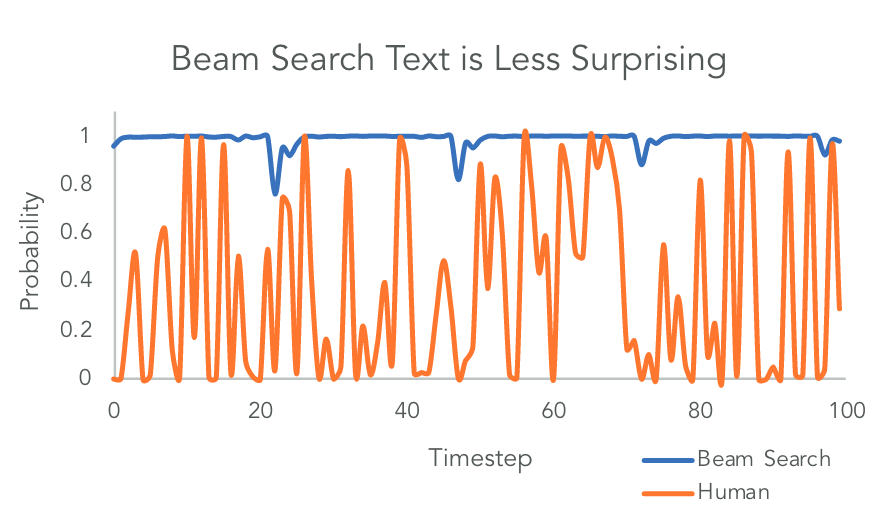

## Introduction

### Hyper-parameters

Inference with LLM provides with some hyper-parameters determining some extent of diversity and randomness.

#### Prior Knowledge

In order to introduce the diversity, current Large Language Models (LLMs) samples the next word with particular sampling methods from some number of probable choices rather than directly decoding the next word with MAP, where you could only get one factual solution which is obvious deterministic.

[1] discovered beam search (i.e., an approximation approach of MAP) results in a different distribution than human during decoding text demonstrated in the below figure.



The paper introduced Nucleus Sampling to fix the problem. Randomness participates in the result by dynamically sampling from the top-$p$ portion of the probability mass in the candidate pool rather than the fixed top-$k$ tokens. In other words, the diversity of the results is dependent on the result distribution of softmax.

The formal definition of Nucleus Sampling is that picks a subset of the vocabulary $V^{(P)} \subset V$ , where $V^{(P)}$ is the smallest set of tokens that


$$
\sum_{x_i \in V^{(P)}} P(x_i | x_{1:i-1}) \ge p
$$

- **Temperature**: A measure of diversity or unpredictability of the output. With the temperature increasing, LLM's outputs become more creative or diverse as the result of increasing likelihood of less probable tokens. Otherwise, outputs are more deterministic.
- **Top-p**: Hyper-parameter for Nucleus Sampling.
- **max_tokens**: A hard cutoff limit for token generation. When the length of generated text exceeds the `max_tokens`, the text gets to cutoff right at there.
- **stop**: Stop sequence. A set of tokens that stops the text generation.

## Formatted Prompt

-  Placeholder `<mask/>`

## Prompting Methods

> [!abstract] Four Key Components of A Prompt
>
> - Instruction: a specific task
> - *Context*: auxiliary and background information provided to the model to collaborate, avoid as much confusion/uncertainty as possible.
> - *Input Data*: input may be of different medium.
> - *Output Indicator*: the form of output or some extra information extends *context*.

### Zero-shot Prompting

Zero-shot prompting is originated from zero-shot learning (ZSL) which is learning problem where a learner is required to perform inference with samples that are unseen during training. Similarly, zero-shot prompting is providing such a prompt that is unseen during training.

> [!example]
>
> Sentiment analysis is generic task which most of LLMs have trained and understood. In this case, asking the model to classify a sentence that it have not yet seen into "positive" and "negative" without explicit examples is still feasible. Such a prompting is called zero-shot prompting.

### Few-shot Prompting

Few-shot prompting can be regarded as zero-shot prompting that articulates with examples. As mentioned above in the example, the model is capable of understanding tasks it was trained for even without seeing the text input in training instances, such as sentiment analysis, but it is vulnerable to vague or complex tasks. Few-shot prompting is meant to solve these tasks by providing with demonstrations and guidance.

> [!danger] Limitation
>
> Few-shot prompting cannot deal with complex combined tasks. For example, a prompt, "The odd numbers in this group add up to an even number: 4, 8, 9, 15, 12, 2, 1", could be classified as a True statement. The reason for that is the model does not understand the connection between two antonym, odd and even, in the same sentence. An approach of solving this kinds of task is splitting the task and applying with Chain-of-thought prompting (and fine-tuning).
>
> > [!tip] Update
> >
> > The newest model seems to apply the Chain-of-thought prompting by intrinsic and hence solves the problem.

### Chain-of-thought (CoT) Prompting

Chain-of-thought prompting, in a brief, does complex reasoning tasks by taking intermediate steps into consideration instead of skipping and getting an answer directly.

> [!example]
>
> Take the prompt in few-shot prompting as an example, "The odd numbers in this group add up to an even number: 4, 8, 9, 15, 12, 2, 1".
>
> - [Prompt 1] The odd numbers in an array of (4, 8, 9, 15, 12, 2, 1) are (9, 15, 1).
> - [Prompt 2] The the sum of odd numbers in [Prompt 1] is `9+15+1=25`.
> - [Prompt 3] The result in [Prompt 2] 25 is an odd number.

> [!success] Improvement: Zero-shot CoT
>
> Simply append "Let's think step by step." to the end of the question to enable CoT.

> [!success] Improvement: Auto-CoT Prompting
>
> Auto-CoT consists of two stages:
>
> 1. Clustering the questions (e.g., $k$-means).
> 2. Generate demonstration for questions in each cluster with zero-shot CoT prompting.
>
> > [!tip] Update
> >
> > Automatic Prompt Engineer (APE), prompt with "Let's work this out in a step by step way to be sure we have the right answer".

The way I think of Auto-CoT is few-shot CoT with demonstration generated automatically.

### Self Consistency

In short, ask the model the same question multiple times and find the common answer as the final answer.

Due to the randomness that LLMs born with, the output for the same question in multiple runs could be totally different. That also provides with means of sampling from them. The answer with majority appearance or emerging are, by definition, consistent.

### Generated Knowledge Prompting

Generated knowledge prompting consists of two stages:

1. Generating knowledge (with zero-shot or few-shot prompting) for important entities in the question
2. Integrating knowledge with the question

Separating those two stages in two prompts normally works better than assembling them into one prompt. The former approach enables in-context learning in a CoT way, while the later may prompt the model to recognize the question in a sequential order, and hence the model does not integrate the knowledge and answer in a effective way.

> [!success] Variation: Recitation-Augmented Language Models
>
> Compared to Generated Knowledge Prompting, this approach extends few-shot to the model to generate and answer in the same step (i.e., single prompt) by asking the model to recite generated knowledge. In such a reinforced way, the model is guaranteed to consider the fact/knowledge and combine them into the answer in semantic (prevent the model from fabricating it by just evaluating maximum likelihood of next token).

### Complex Tasks

#### Tree-of-Thought (ToT)

Tree-of-Thought prompting is proposed due to the previous prompting methods lacking of capability to strategic lookahead.

> [!quote]
>
> Quote from [5], "This perspective highlights two key shortcomings of existing approaches that use LMs to solve general problems: 1) Locally, they do not explore *different* continuations within a though process - the branches of the tree. 2) Globally, they do not incorporate any type of planning, lookahead, or backtracking to help evaluate these different options - the kind of heuristic-guided search that seems characteristic of human problem-solving."

Consider chain-of-thought as a combination of each intermediate result in the one-way casual chain, tree-of-thought is more like performing search algorithms (e.g., BFS, DFS and etc) on a decision tree, in which each node represents the intermediate result after a certain action.

ToT consists of four stages:

1. Root Identification (Problem Definition): Analyze the question and decompose thought, by which action the model performs can it transition between states, including,
   - Identify the core question or topic,
   - Establish the context and desired outcome and
   - Determine the scope and limitations.
2. Branch Expansion (Exploration): Explore various subtopics, angles, and perspectives related to the main goal, including,
   - Generate sub-questions and related topics,
   - Consider different aspects and dimensions of the problem and
   - Gather relevant information and ideas.
3. Leaf Development (Detailing and Refinement): Develop detailed prompts or questions based on the explored branches, ensuring they are specific, clear, and aligned with the main goal, including,
   - Refine the sub-questions into precise prompts,
   - Ensure clarity and relevance of each prompt and
   - Tailor the language and structure to elicit the desired type of response.
4. Pruning and Synthesis (Optimization and Integration): Review and optimize the generated prompts, integrating the best elements into a cohesive set of queries, including,
   - Evaluate the quality and effectiveness of each prompt,
   - Remove redundant or less relevant prompts and,
   - Combine related prompts to form comprehensive questions.

#### Reasoning And Acting

Reasoning and acting (ReAct).

## Best practice with OpenAI API

### Rules

[4] explains 8 essential rules of best practicing for prompt engineering with OpenAI APIs as following:

1. Use the latest model

2. Put the `<instruction>` at the beginning and use `###` or `"""` to separate `<instruction>` and `<context>`

   - e.g., 

   ```
   <instruction> Summarize the text below
   
   Text: """
   <context> {text input}
   """
   ```

3. Be specific, descriptive and as detailed as possible about the desired context, outcome, length, style and etc.

4. Articulate the desired output format through examples.

5. Start with zero-shot, then few-shot (example), neither of them worked, then fine-tune.

6. Reduce imprecise descriptions.

7. Instruct what to do rather than the opposite.

8. Specific to code generation, use some hints (e.g., start with `import` implying work with Python) to calibrate the model with particular patterns.

### Reference

- [1] A. Holtzman, J. Buys, L. Du, M. Forbes, and Y. Choi, “The Curious Case of Neural Text Degeneration.” arXiv, Feb. 14, 2020. Accessed: Aug. 22, 2023. [Online]. Available: [http://arxiv.org/abs/1904.09751](http://arxiv.org/abs/1904.09751)
- [2] Prompt Engineering Guide. Url: https://www.promptingguide.ai/introduction
- [3] Learn Prompting. Url: https://learnprompting.org/docs/intro
- [4] Best practices for prompt engineering with OpenAI API. Url: https://help.openai.com/en/articles/6654000-best-practices-for-prompt-engineering-with-openai-api
- [5] S. Yao _et al._, “Tree of Thoughts: Deliberate Problem Solving with Large Language Models.” arXiv, May 17, 2023. Accessed: Aug. 25, 2023. [Online]. Available: [http://arxiv.org/abs/2305.10601](http://arxiv.org/abs/2305.10601)