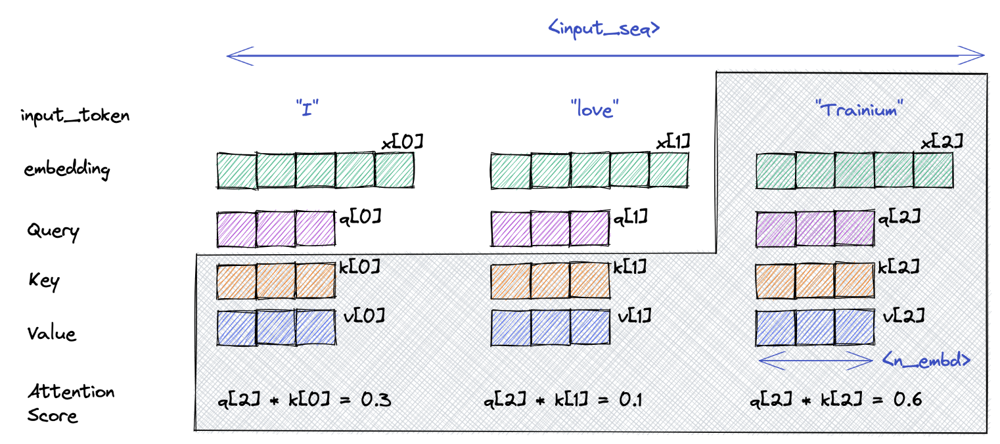

## Inference Procedure

A general inference of a LLM is composed by two steps, Prefill Phase and Decode Phase. During the prefill phase, LLMs processes users' inputs in a forward pass. Next, LLMs convert logits from the last layer to a single token (as in decode) at a time.

> [!quote]
> The paper stated that the latency for an inference is composed by two major factors, "the time to process the input tokens present at the start of the inference, and the time to autoregressively generate output tokens", which they call prefill and decode respectively [^1].

[^1]: R. Pope _et al._, “Efficiently Scaling Transformer Inference”.

### Prefill

#### Tokenization

### Decode

A formal definition of *open-ended* generation is to generate the next $n$ continuation tokens, while maintaining a meaningful and insightful sequence $\mathbf{x}$ ($\{x_1, \cdots, x_{m+n}\}$), given input $m$ tokens ($\{x_1,\cdots,x_{m}\}$) text passage as context. The language model then compute $P(x_{1:m+n})$ with decomposition of the probability,

$$
\begin{align}
P(x_{1:m+n}) &= \prod_{i=1}^{m+n}P(x_i \mid x_1,\cdots,x_{i-1})\\
&= \prod_{i=1}^{m+n}\frac{\exp(u_i)}{\sum_j\exp(u_j)}
\end{align}
$$

which converts the vector into logits using softmax. Subsequently, we decode logits into tokens based on a particular decoding strategy. From the equation, one should note that we are calculating the conditional probability with data dependence. The probability of each new token depends on prior tokens. As a consequence, such data dependence restricts LLM to perform inference on one token at a time.

Generally, the decoding strategy can be categorized into two methods, including maximization-based and sampling-based. We are going to briefly introduce greedy search and beam search that are trying to maximize the probability of logits with or without heuristics, as well as top-k sampling and nucleus sampling that introduce randomness to the output.

#### Maximization-Based Decoding

**Greedy Search** simply chooses a token with the highest probability, and it is mathematically defined by,

$$
w =\arg\max_{x \in V}\ P(x \mid x_{1:i-1}).
$$

Similar to other greedy algorithms, greedy search achieves local optimal at each time step, may leading to globally sub-optimal decisions.

**Beam Search** extends greedy search by bringing in $n$ candidates as heuristics. As decoding proceeding, we always keep $n$ best choices and generating accordingly until an `EOS` token is met. Beam search mitigate the limitation of greedy search by generating extra $n$ hypothesis to expand the search space.

> An example of the process of beam search, with beam size is set to two in three consecutive time steps, is illustrated below,
> 
> [Dive into Deep Learning Chapter 10 Section 10.8.3 Beam Search Fig. 10.8.3](https://d2l.ai/chapter_recurrent-modern/beam-search.html#id1)

> [!bug] Limitations
> Both greedy search and beam search can be categorized as Maximization-based decoding, whose objective is to assign higher probability to higher quality text. However, several researches showed that they failed to generate high quality nor diversity text on open-ended generation.

#### Sampling-Based Decoding

**Sampling with Temperature** generates tokens in a random fashion. By introducing temperature $t$, random sampling is able to broaden the gap between candidates with higher probability and the others. It is mathematically defined as,

$$
P(x_i \mid x_{1:i-1}) = \frac{\exp(u_i/t)}{\sum_j\exp(u_j/t)}
$$

where $t \in (0,1]$ is called temperature. Although, in the bright side, random sampling enhances the generated response with randomness and unpredictability, so that no tokens are guaranteed to appear. Undoubtedly, random sampling without empirical information or prior distribution can be impractical if the sampling space is large.

**Top-k Sampling** follows the idea of random sampling but comes with an improvement by selecting from the top $K$ candidates. In other words, we apply random sampling until $K$ tokens are specified. It is mathematically defined as,

$$
P^\prime(x_i \mid x_{1:i-1}) = 
\begin{cases}
\frac{P(x_i \mid x_{1:i-1})}{S},\ & \text{if }x_i \in V^{(k)}\\
0,\ & \text{otherwise}
\end{cases}
$$

where $V^{(k)}$ is the set of $k$ tokens with the highest probabilities. Top-k sampling does add some fluency and sense, but the $PDF$ shifts over time. $K$ also should have varied targeting to different distributions.

> [!warning]
> An intuitive example of the problem is considering a flat distribution with a small $k$ and a peaked distribution with a large $k$. To begin with, a small $k$ in flat distribution implies that, even though top-k sampling was initially proposed to expand the hypothesis space, such a small $k$ prevents other tokens with slightly lower probability to be sampled from.
> 
> [THE CURIOUS CASE OF NEURAL TEXT DeGENERATION](https://openreview.net/pdf?id=rygGQyrFvH)

**Nucleus Sampling** (or also known as Top-p Sampling) aims to address the issue of top-k sampling. Instead of picking a fixed number of candidates, it set a threshold $p$ for cumulative probabilities of a group of candidates. It is thus defined as,

$$
P^\prime(x_i \mid x_{1:i-1}) = 
\begin{cases}
\frac{P(x_i \mid x_{1:i-1})}{S},\ & \text{if }x_i \in V^{(p)}\\
0,\ & \text{otherwise}
\end{cases}
$$

where $S = \sum_{x_i \in V^{(p)}} P(x_i | x_{1:i-1}) \ge p$.


> [Stealing the Decoding Algorithms of Language Models](https://people.cs.umass.edu/~amir/papers/CCS23-LM-stealing.pdf)

## Optimization

### Prior to Optimization

Before getting into real methods for serving LLMs and Inference Optimization, we need to know about [[Bottleneck Analysis#Important Metrics for LLM Serving]].

### Continuous Batching

[[Bottleneck Analysis#Memory Bandwidth]]

The GPU is born for compute-intensive tasks with its massive-parallel architecture. With a single request, GPU normally struggles to fully utilize its computational power in parallelism. Thus, batching a group of requests for GPU with scheduling algorithms significantly mitigates the issue.

Continuous batching is revised over traditional/static batching algorithm. Static batching waits for all requests to complete in an execution engine. The problems become obvious when some requests are early-finished or late-arrived. Those requests halted until requests with longer input (i.e., in terms of sequence length) finished.


As illustrated above, sequence $S3$ emits an `<EOS>` token yet to be able to return the response at time $T5$, as other batching sequences in GPU are still in processing.


The intuition of continuous batching is that keeps inserting a new sequence once a sequence emits an `<EOS>` token. Due to different phases (i.e., prefill and generation) sequences might be in, continuous batching does not know when to stop. The parameter `waiting_serverd_ratio` (available in Huggingface) currently controls the ratio of waiting queries and running queries. Once it has been reached, GPU stops receiving new coming sequences but to be focus on existing unfinished ones.

> [!note]
> Continuous batch sometimes may refer to batching with iteration-level scheduling.

### K/V-Caching

Due to the nature of "token-by-token" generation in LLM (i.e., iteratively invoke LLM to generate next token's prediction), the **Query** vector of the current single token is multiplied by the **Key** vectors of all the previous tokens in the sequence to create attention scores, and the results are further multiplied by the **Value** vectors of all previous tokens. The whole matrix multiplications, $QK^\intercal V$, seems to be repetitive and computational-expensive, considering vectors of previous tokens have been calculated more than once.

Intuitively, caching **Key** and **Value** vectors and appending new scores each time after attention layer could optimize the performance. 

> [!success] Illustration of K/V caching
> 
> 

However, K/V cache stores in the accelerator RAM (i.e., DRAM in GPU in general). It soon becomes explosive as the batch size grows, as in
$$
\begin{align}
\mathrm{Cache\_size(FP16)} =\ &2 \times 2 \times \mathrm{batch\_size} \times \mathrm{seq\_length}\\
&\times \mathrm{num\_layers} \times \mathrm{embed\_length},
\end{align}
$$
where the first $2$ comes from two cached matrices, $Q$ and $V$, and the second refers to FP16 as well as two bytes.

> [!info] Other attention mechanisms may help
> - Multi-Query Attention
> - Group-Query Attention
> - Sliding Window Attention
> - Flash Attention v1 and v2
> - Paged Query Attention

#### Prefix caching

This optimization is only applicable when users have common prefixes in their prompts.

### Speculative Decoding

The idea behind the speculative decoding is to use the small model ($\mathrm{M}_q$) to approximate the output of a large model ($\mathrm{M}_p$). Initially, we predict several completions in parallel with small models. Than we evaluate the completion results with large models to check their validity. Finally, the large model decides whether to accept the completions or partially accept. As a result, our models generates one valid token each iteration and potentially more of it.

The performance is strongly dependent on how well the small models can approximate large models. The larger acceptance rate of completions that large models can get, the more performance optimization we can achieve.

```python

def sps(x, Mq, Mp, N, K):
    """
    Args:
        x: input prompts
        Mq: the draft (small) model
        Mp: the target (large) model
        N: the number of tokens to be decoded
        K: lookahead
    """
    n = len(x)
    T = n + N

    max_fn = lambda x : np.where(x > 0, x, 0) / np.sum(np.where(x > 0, x, 0))
    sample = lambda p : np.random.choice(np.arange(p.shape[-1]), p=p)

    while n < T:
        x_q = x
        for _ in range(K):
            p = Mq(x_q)
            x_q = np.append(x_q, sample(p[-1]))
        q = Mp(x_q)

        accepted = True
        for _ in range(K):
            i = n - 1
            j = x_q[i + 1]
            if np.random.random() < min(1, q[i][j] / p[i][j]):
                x = np.append(x, j)
                n += 1
            else:
                x = np.append(x, sample(max_fn(q[i] - p[i])))
                n += 1
                accepted = Fasle
                break

        if accepted:
            x = np.append(x, sample(q[-1]))
            n += 1

    return x
```

> [!quote]
> According to the experiment carried out in \[4\], using a 4B model to approximate Chinchilla 70B gains optimization of performance listed as follows,
> 
> 

> [!success] Prompt Lookup Decoding
> For down-stream tasks where tokens have strong relationships between they are in input and output (e.g., summarization, Q&A and code editing), the draft model can be modeled using n-gram.

#### Medusa

> [!abstract]
> Medusa is a simple framework that accelerates LLM generation with multiple decoding heads.

### Quantization

[[Bottleneck Analysis#Memory Bandwidth]]

Quantization reduces memory and compute requirements by rescaling weights and/or activations to shorter data types while remaining the accuracy as much as possible.

The intuition behind quantization is rescaling weights and activations from the larger scale (e.g., FP32) to the smaller scale (e.g., INT8) with some **mapping functions**.

#### Minimum and Maximum

Our first attempt is as simple as using minimum and maximum values of the input range (i.e., $-r, r$ shown above), also known as *Absolute Maximum Quantization*.


The problem also appears in its sensitivity to outliers that large space is not utilized (i.e., $-128 \mathrm{\ to\ } X_q$). The first solution comes to mind must be removing outliers and then calculating the mapping function. But again, this introduces the divergence between input distributions and quantized distributions while we remove outliers.

Kullback-Leibler (KL) divergence comes to be handy to determine the threshold for outliers between two distributions to be converged.

### PageAttention

### FlashAttention

### Disaggregated Prefilling Decoding Architecture

As mentioned above, Decode phase for casual LLM is normally operated in an autoregressive fashion. In other words, LLM decodes logits into tokens one at a time. On the contrary, Prefill phase harness the power of parallel computing, leading to an embarrassment where 

### Operator Fusion

### Compression

### Distributed Inference


## Reference

1. [Generative LLM inference with Neuron](https://awsdocs-neuron.readthedocs-hosted.com/en/latest/general/appnotes/transformers-neuronx/generative-llm-inference-with-neuron.html?highlight=kv%20cach#kv-caching)
2. [Orca: A Distributed Serving System for Transformer-Based Generative Models](https://www.usenix.org/conference/osdi22/presentation/yu)
3. [How continuous batching enables 23x throughput in LLM inference while reducing p50 latency](https://www.anyscale.com/blog/continuous-batching-llm-inference)
4. [Accelerating Large Language Model Decoding with Speculative Sampling](https://arxiv.org/pdf/2302.01318)
5. [Speculative Sampling - Jay Mody's blog](https://jaykmody.com/blog/speculative-sampling/)
6. R. Y. Aminabadi _et al._, “DeepSpeed Inference: Enabling Efficient Inference of Transformer Models at Unprecedented Scale.” arXiv, Jun. 30, 2022. Accessed: Jul. 04, 2024. [Online]. Available: [http://arxiv.org/abs/2207.00032](http://arxiv.org/abs/2207.00032)
7. [Mastering LLM Techniques: Inference Optimization](https://developer.nvidia.com/blog/mastering-llm-techniques-inference-optimization/) from Nvidia Technical Blog