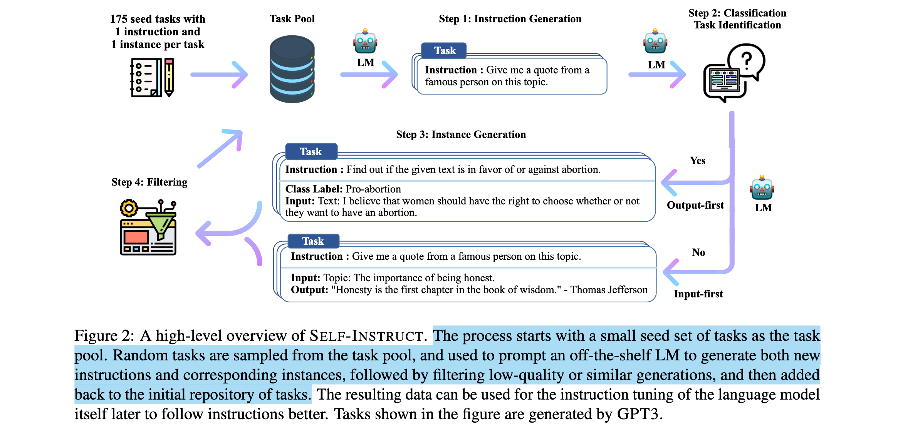

Up: [[Transfer Learning]]

## Overview

Fine-tuning is normally a goto method of adapting a pre-trained model to various specific downstream tasks. Compared to training a pre-trained model in an unsupervised manner, updating it with fine-tuning usually uses a significantly smaller amount of labeled data in a supervised manner. Accordingly, the result of supervised fine-tuning (SFT) is strongly dependent upon the dataset that has been curated.

## Categories

- Full Fine-Tuning
- Parameter Efficient Fine-tuning (PEFT)
  - Prefix-Tuning
  - Prompt-Tuning
  - Lower Rank Adaptation (LoRA) Based Variants
    -  LoRA
    -  LongLoRA
    -  QLoRA
  - Adapter Tuning
- Instruction Fine-Tuning
- Reinforcement Learning from Human Feedback (RLHF)

## Full Parameter Fine-tuning

Full fine-tuning comes with the idea, training all model parameters on a labeled dataset.

### Dataset

#### HuggingFace `trl`

```python
from transformers import AutoModelForCausalLM
from datasets import load_dataset
from trl import SFTTrainer

dataset = load_dataset("/path/to/dataset")
model = AutoModelForCausalLM.from_pretrained("model")
trainer = SFTTrainer(model, 
                     train_dataset=dataset,
                     dataset_text_field="text",
                     max_seq_length=512)  # adapt to your dataset

trainer.train()
```

## PEFT

The conditional full fine-tuning method is often costly due to 100% trainable parameters being fine-tuned. Parameter-efficient Fine-tuning methods are thus introduced to mitigate the inefficiency by only adjusting a small subset of the model parameters, leaving the rest frozen. At the meantime, recent state-of-the-art PEFT methods achieve performance comparable to fully fine-tuned models.


### Prompt-Tuning

The essence of **Prompt Tuning** is learning a "soft prompts" (i.e., a learnable tensor) to condition frozen language models to perform specific downstream tasks. The input thereby becomes the concatenation of a prompt tensor and an input text embedding. In short, prompt tuning prepends a trainable prompt tensor to the input text embedding.


#### HuggingFace PEFT

```python
from peft import PromptTuningConfig, PromptTuningInit, get_peft_model

prompt_tuning_init_text = "Classify if the tweet is a complaint or no complaint.\n"
peft_config = PromptTuningConfig(
    task_type="CAUSAL_LM",
    prompt_tuning_init=PromptTuningInit.TEXT,
    num_virtual_tokens=len(tokenizer(prompt_tuning_init_text)["input_ids"]),
    prompt_tuning_init_text=prompt_tuning_init_text,
    tokenizer_name_or_path="bigscience/bloomz-560m",
)
model = get_peft_model(model, peft_config)
```

### Prefix-Tuning

Prefix Tuning, by keeping language model parameters frozen and instead optimizes a sequence of continuous task-specific (also called as *prefix* in the paper) vectors. As demonstrated in the figure below, prefix tuning adapts to prompting techniques with learnable prefix so that different prefix helps model differentiate various downstream tasks without fine tuning all of model parameters at once.


#### HuggingFace PEFT

```python
from peft import PrefixTuningConfig, get_peft_model

peft_config = PrefixTuningConfig(task_type="CAUSAL_LM", num_virtual_tokens=20)
model = get_peft_model(model, peft_config)
```

### Low Rank Adaptation (LoRA)

LoRA is theoretically supported by the paper, "Intrinsic Dimensionality Explains the Effectiveness of Language Model Fine-Tuning". That being said, large language models have a lower intrinsic dimension. In other words, updated matrices could have a lower rank instead of full rank.

The beauty of LoRA is learning a smaller amount of parameters rather than update the whole weight matrices all over again. So, LoRA freezes the pretrained weights and learns the residual weight (i.e., $W^\prime = W + \Delta W$). Secondly, the residual weight is further decomposed into two lower rank matrices $A$ and $B$ (i.e., $\Delta W = A \times B^\mathsf{T}$). 

The parameter reduction comes from the next step. During decomposition, the dimension can be reduced by the following,
$$
\Delta W^{n \times m} = A_{n \times d} \times B^{\mathsf{T}}_{m \times d},
$$
where $d$ is a hyper-parameter.

> [!note]
> The paper showed when fine-tune a transformer based neural network with LoRA, only $W_q$, $W_k$, $W_v$ needs to be updated.

#### Implementation

```python
class LoraRobertaSelfAttention(RobertaSelfAttention):
    def __init__(self, r=8, *args, **kwargs):
        super().__init__(*args, **kwargs)
        d = self.all_head_size

        # Matrix B is initialized to zero matrix size of d x r
        # Matrix A is initialized to random numbers drawn from normal distribution size of r x d
        self.lora_q_B = nn.Parameter(torch.zeros(d, r))
        self.lora_q_A = nn.Parameter(torch.randn(r, d))
        self.lora_v_B = nn.Parameter(torch.zeros(d, r))
        self.lora_v_A = nn.Parameter(torch.randn(r, d))

    def lora_query(self, x):
        lora_q_w = torch.matmul(self.lora_q_B, self.lora_q_A)
        return self.query(x) + F.linear(x, lora_q_w)

    def lora_value(self, x):
        lora_v_w = torch.matmul(self.lora_v_B, self.lora_v_A)
        return self.value(x) + F.linear(x, lora_v_w)

    def forward(self, hidden_states, *args, **kwargs):
        mixed_query_layer = self.lora_query(hidden_states)
        key_layer = self.transpose_for_scores(self.key(hidden_states))
        value_layer = self.transpose_for_scores(self.lora_value(hidden_states))
        ...
```

#### HuggingFace PEFT

```python
from peft import get_peft_model, LoraConfig, TaskType

peft_config = LoraConfig(task_type=TaskType.SEQ_2_SEQ_LM, 
                         inference_mode=False, 
                         r=8,  # the rank of the update matrices
                         lora_alpha=32, 
                         lora_dropout=0.1)

model = get_peft_model(model, peft_config)
model.print_trainable_parameters()
```

#### Advantages And Disadvantages

LoRA significantly reduces the parameters that need to be learned. Supposing there is a updated matrix is of dimension $600\times400$ and $d$ being 6, during the decomposition stage of LoRA, it becomes $A$ of dimension $600 \times 6$ and $B$ of dimension $400 \times 6$. The number of parameters need to be learned is reduced from $600\times400=240000$  to $600\times6+400\times6=6000$.

Another advantage of LoRA is that it trains on the residual matrix, so that it keeps updated matrix independently. Developers could switch different pairs of $A_iB_i^\mathsf{T}$ to adapt different downstream tasks $i$ at runtime.

## Adapter Tuning

The Adapter yields a compact and extensible module (or layers) to the existing model. The adapter module adds only a few trainable parameters per task, while parameters of a pre-trained model remain frozen.


The placement of Adapters is preferred on the higher layer, as adapters on the lower layer may capture more of low-level features shared among tasks, while they extract high-level unique features that differentiates tasks. Although adapter tuning reduces the number of model parameters required to fine-tune, the size of model is unavoidably increased due to additional layers introduced as adapters.

## Contrastive Fine-Tuning

The model learns through contrastive loss by distinguishing similar and dissimilar pairs of samples, enhancing the ability of models to perform embeddings.

## Instruction Fine-Tuning

Instruction Fine-Tuning (IFT) is yet another supervised fine-tuning method, which is first introduced in the paper *Finetuned Language Models are Zero-shot Learners*[^1]. The whole idea is intuitive based on NLP tasks can be described via natural language instructions. People usually distinguish IFT and SFT by datasets. Each training sample in an instruction dataset is typically comprised by *an instruction* specifying the given task, *additional information* providing contexts or prompts to guide towards a resolution, and of course *the target output*.

[^1]: J. Wei _et al._, “Finetuned Language Models are Zero-Shot Learners,” presented at the International Conference on Learning Representations, Oct. 2021. Accessed: Oct. 18, 2024. [Online]. Available: [https://openreview.net/forum?id=gEZrGCozdqR](https://openreview.net/forum?id=gEZrGCozdqR)

IFT has been a successful fine-tuning method, particularly for the **multi-task learning and zero-shot learning scenario**, because of its combination of appealing aspects of both the pretrain-finetune and prompting paradigms (demonstrated in fig 2). Meanwhile, it alleviate the necessity of prompt engineering and few-shot exemplars to help LLMs recognize and shift among tasks.


A general format for IFT is 

```json
[
    {
        "instruction": "<human instruction>",
        "input": "[human input]",
        "output": "<model output>",
        "system": "[system prompt]",
        // for multiple-round conversation
        "history": [
            ["[first_round_instruction]", "[first_round_output]"],
            ["[second_round_instruction]", "[second_round_output]"]
        ]
    }
]
```

### Curated Instruction Datasets

FLAN (Finetuned Language Net) is instruction fine-tuned on a mixture (shown in fig 3) of more than 60 NLP datasets.


As creating instruction for all 60 datasets would cost tremendous resources, FLAN manually compose 10 templates describing each existing dataset and extra 3 templates with another possible task descriptions. Take datasets *RTE* and *WSC* for example, defined templates are listed in the following,


### LLM-Generated Instruction Datasets

With the increasing prevalence of synthetic augmentation and the challenges associated with curating instructions for large volumes of data, synthetic instruction datasets appear to be a practical solution. Both of Self-Instruct[^2] and Stanford's Alpaca[^3] put the idea into practice.

Alpaca prompted a strong LLM, i.e., OpenAI's ChatGPT model, to generate 52K instruction following demonstrations based on 175 human-written instruction-output exemplars. You can learn more about [Alpaca's Datasets](https://github.com/tatsu-lab/stanford_alpaca/blob/main/datasheet.md).


Self-Instruct applies an iterative method that iterates over LLM-generated instructions and adds to datasets only if their ROGUE-L similarity with any existing instruction is less than 0.7 for the purpose of diversity.



[^2]: Y. Wang _et al._, “Self-Instruct: Aligning Language Models with Self-Generated Instructions,” in _Proceedings of the 61st Annual Meeting of the Association for Computational Linguistics (Volume 1: Long Papers)_, A. Rogers, J. Boyd-Graber, and N. Okazaki, Eds., Toronto, Canada: Association for Computational Linguistics, Jul. 2023, pp. 13484–13508. doi: [10.18653/v1/2023.acl-long.754](https://doi.org/10.18653/v1/2023.acl-long.754).
[^3]: Rohan Taori _et al._, “Alpaca: A Strong, Replicable Instruction-Following Model.” Accessed: Aug. 19, 2024. [Online]. Available: [https://crfm.stanford.edu/2023/03/13/alpaca.html](https://crfm.stanford.edu/2023/03/13/alpaca.html)

Although IFT exhibit the promising performance on zero-shot learning for multi-task scenarios, its requirement of responding to an instruction adds additional necessary fine-tuning cost to pretrained models. 

## RLHF

Reinforcement Learning from Human Feedback (RLHF) is an approach of optimizing language models by adapting to the feedback interfered by human preferences. RLHF was introduced to language models in NLP field - fine-tuning GPT-3 to follow a broad class of written instructions - in 2020 by OpenAI. The process has been summarized into three steps, including

1. Collect human feedback (SFT),
2. Collect comparison data, and train a reward model,
3. Optimize a policy against the reward model using reinforcement learning.


### Prepare Dataset

The format of the dataset is in question-answering style. In other words, it looks like,

```json
[
  {
    "prompt": "blablabla",
    "answer1": "blablabla",
    "answer2": "blablabla",
  },
  {...}
]
```

The question-answering dataset is generated automatically. The pre-trained models are used as zero-shot QA generators. Subsequently, we jsonify the resulting triplet examples (i.e., prompt-answer1-answer2).

```python
def create_cmp_dataset(path: str,
                       split: str = "train") -> List[Dict[str, str]]:
    if split != "test":
        dataset = load_dataset(path, split=split)
    else:
        dataset.select(range(10000))

    pairs = []
    for sample in tqdm(dataset):
        pair = {}
        prompt = sample["prompt"]
        chosen = sample["chosen"]
        reject = sample["rejected"]
        if chosen == reject:
            continue
        # sample data with invalid length
        if len(chosen.split()) < 5 or len(reject.split()) < 5:
            continue
        pair["chosen"] = f'{prompt}"\n"{chosen}'
        pair["reject"] = f'{prompt}"\n"{reject}'
        pairs.append(pair)
    return pairs


class PairwiseDataset(Dataset):
    def __init__(self, pairs, tokenizer, max_length):
        self.chosen_input_ids = []
        self.chosen_attn_mask = []
        self.reject_input_ids = []
        self.reject_attn_mask = []
        for pair in tqdm(pairs):
            chosen, reject = pair["chosen"], pair["reject"]
            chosen_enc_dict = tokenizer(
                f'<|startoftext|>{chosen}<|endoftext|>',
                truncation=True,
                max_length=max_length,
                padding="max_length",
                return_tensors="pt"
            )
            reject_enc_dict = tokenzier(
                f'<|startoftext|>{reject}<|endoftext|>',
                truncation=True,
                max_length=max_length,
                padding="max_length",
                return_tensors="pt"
            )
            self.chosen_input_ids.append(
                chosen_enc_dict["input_ids"])
            self.chosen_attn_mask.append(
                chosen_enc_dict["attention_mask"])
            self.reject_input_ids.append(
                reject_enc_dict["input_ids"])
            self.reject_attn_mask.append(
                reject_enc_dict["attention_mask"])

    def __len__(self):
        return len(self.chosen_input_ids)


    def __getitem__(self, idx):
        return (self.chosen_input_ids[idx],
                self.chosen_attn_mask[idx],
                self.reject_input_ids[idx],
                self.reject_attn_mask[idx])
```

### Label Dataset

As the name suggested, human feedback, we human need to interfere the question-answering procedure with our preferences. Obviously, one way of doing so is labelling. Labeling the dataset with [Label Studio](https://labelstud.io/) to create annotations along with the original dataset. A typical task template is the [Pairwise Classification](https://labelstud.io/templates/pairwise_comparison).

### Train Reinforcement Learning

There are some RL training frameworks that help ease RL procedure, such as,

- Transformer Reinforcement Learning (trl) was first introduced in 2020 as a full stack library to fine-tune and align large language models using reinforcement learning methods (e.g., SFT, RM, PPO, DPO and etc.) officially by Hugging Face. TRL is built on top of the `transformer` library, contributing to the convenient RL training directly with any models that `transformer` provides.
- Transformer Reinforcement Learning X (trlX) is an enhanced successor (originally inspired by) of TRL. TRLX leverages efficient parallelism to distributed training backed by NVIDIA NeMo trainers as well as seamlessly integrated with Hugging Face models through Accelerate-backed trainers.
- Reinforcement Learning for Language Models (RL4LMs) emerged with its high customizability. RL4LMs provides customizable building blocks, allowing developer to easily tackle with custom dataset, reward functions, custom metrics and police algorithms.

Take trlX for example. A sample RL training snippet,

```python
import trlx
from trlx.data.configs import ModelConfig, OptimizerConfig, SchedulerConfig, TokenizerConfig, TrainConfig, TRLConfig
from trlx.models.modeling_ppo import PPOConfig

# Training configuration
config = TRLConfig(
    train = TrainConfig(
        seq_length=,
        epochs=,
        total_steps=,
        batch_size=,
        checkpoint_interval=,
        eval_interval=,
        pipeline=,
        trainer=,
    ),
    model=ModelConfig(
        model_path=,
        num_layers_unfrozen=,
    ),
    tokenizer=TokenizerConfig(
        tokenizer_path=,
        truncation_side=,
    ),
    optimizer=OptimizerConfig(
        name=,
        kwargs={
            "lr":,
            "betas":,
            "eps":,
            "weight_decay":,
        },
    ),
    scheduler=SchedulerConfig(
        name=,
        kwargs={
            "T_max":,
            "eta_min":,
        },
    ),
    method=PPOConfig(
        name=,
        num_rollouts=,
        chunk_size=,
        ppo_epochs=,
        init_kl_coef=,
        target=,
        horizon=,
        gamma=,
        lam=,
        cliprange=,
        cliprange_reward=,
        gen_kwargs=
    ),
)

rw_tokenizer = AutoTokenizer.from_pretrained("model_name")
rw_tokenizer.pad_token = rw_tokenizer.eos_token

# Invoking trlx to train with RL
trainer = trlx.train(reward_fn=reward_fn,
                     prompts=train_prompts,
                     eval_prompts=val_prompts,
                     config=config)
# Invoking NVIDIA NeMo-Megatron trainer
#from trlx.trainer.nemo_ilql_trainer import megatron_trainer
#trainer = megatron_trainer(megatron_cfg)
trainer.save_pretrained("/path/to/save/pretrained/")
```

And a reward function is,

```python
def reward_fn(samples: List[str], **kwargs):
    def _get_scores(batch_size: int = 2):
        scores_list = []
        for i in range(0, len(samples), batch_size):
            sub_samples = samples[i:i+batch_size]
            sub_samples = ["<|startoftext|>" + ss + "<|endoftext|>" for ss in sub_samples]
            enc = rw_tokenizer(sub_samples, truncation=True, max_length=config.train.seq_length, padding="max_length", return_tensors="pt")
            input_ids = enc["input_ids"].repeat(2, 1)
            attn_mask = enc["attention_mask"].repeat(2, 1)
            with torch.no_grad():
                sub_scores = rw_model(input_ids=input_ids, attention_mask=attn_mask)
            scores_list.append(sub_scores["chosen_end_scores"])
        scores = torch.cat(scores_list, 0)
        return scores
    reward_scores = _get_scores(samples)
    return reward_scores
```

Launching scripts is,

```bash
# Use HF accelerate to launch distributed training
accelerate config
accelerate launch snippet.py

# Use NVIDIA NeMo to launch distributed training
python snippet.py
```

> [More about NeMo-Megatron setup instructions](https://github.com/CarperAI/trlx/blob/main/trlx/models/README.md)
> [Implementing RLHF: Learning to Summarize with trlX](https://wandb.ai/carperai/summarize_RLHF/reports/Implementing-RLHF-Learning-to-Summarize-with-trlX--VmlldzozMzAwODM2)

---

## Reference

[1] Parameter-Efficient LLM Finetuning With Low-Rank Adaptation (LoRA) URL:lightning.ai/pages/community/tutorial/lora-llm