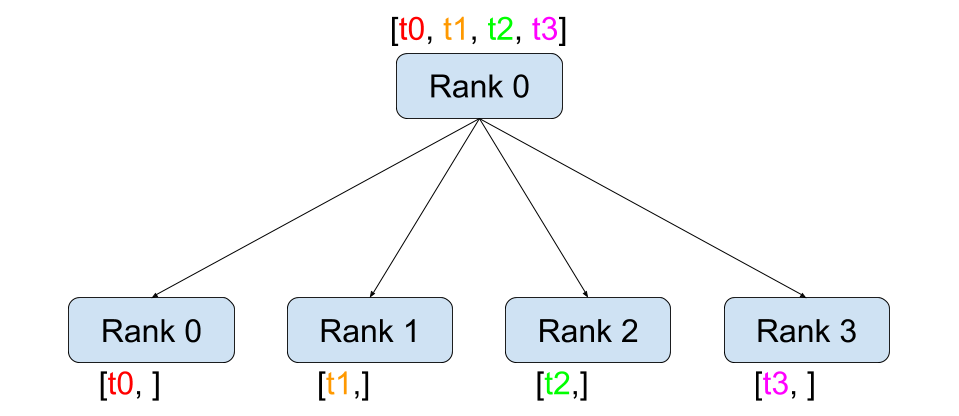
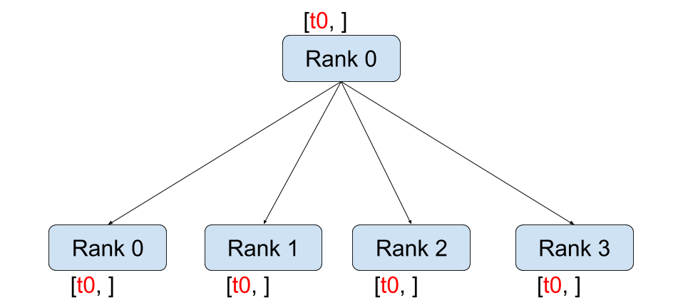
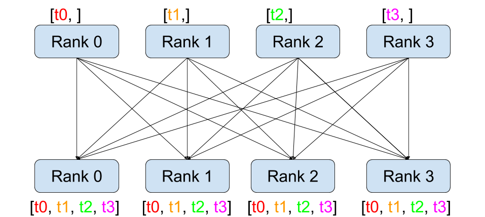
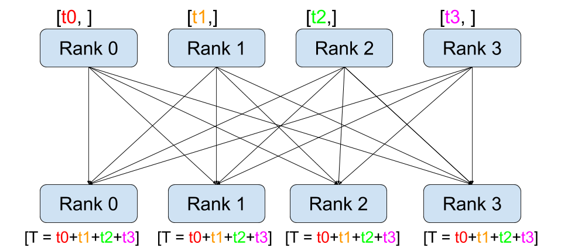

> [!success] Prior
> First read through [[Distributed Training]].

## Distributed Communication

`torch.distributed` module supports two communications between devices, Point-to-Point Communication and Collective Communication.

### Point-to-Point Communication

Point-to-Point (P2P) communication is an approach of communication directly between exactly two processes dedicated running on two devices exclusively, e.g., say Rank 1 and Rank 3. P2P allows two processes to communicate via transferring data through `send` and `recv` functions or their intermediate counter-parts, `isend` and `irecv`. The prior two functions executes synchronously, as in blocking both processes until the communication is completed, in which P2P communication took place.

```python
import torch.distributed as dist
import torch.multiprocessing as mp

def inc(rank, src=0, dst=3):
    """ Send tensor at RANK 0 with increment to RANK 3
    """
    # proper dist.init_process_group is ignored here
    ...
    
    tensor = torch.zeros(1)
    if rank == src:
        tensor += 1
        dist.send(tensor=tensor, dst=dst)
    # IMPORTANT: P2P communication only allows two processes to communicate
    # without the condition `rank == dst`, you are trying to communicate
    # rank 0 with all others, resulting in hang.
    elif rank == dst:
        dist.recv(tensor=tensor, src=src)
    print(f"Rank {rank} has data {tensor}")

if __name__ == "__main__":
    mp.spawn(run, args=(), nprocs=4)

# output:
# Rank 1 has data tensor(0.)
# Rank 2 has data tensor(0.)
# Rank 0 has data tesnor(1.)
# Rank 3 has data tensor(1.)
```


On the contrary, `isend` and `irecv` are asynchronous, as saying that both functions will not be executed directly but scheduled by a scheduler instead. Hence, any writing to `tensor` after `isend` or reading from `tensor` after `dist.irecv` before `req.wait()` has completed will result in undefined behavior.

```python
def run(rank, src=0, dst=3):
    tensor = torch.zeros(1)
    req = None
    if rank == src:
        tensor += 1
        req = dist.isend(tensor=tensor, dst=dst)
        print(f"Rank {src} not yet send")
    elif rank == dst:
        req = dist.irecv(tensor=tensor, src=src)
        print(f"Rank {dst} not yet recive")
    if req is not None:
        req.wait()  # blocking both processes until isend and irecv took place

    # dist.barrier() is another option for more than one process

    print(f"Rank {rank} has data {tensor[0]}")
```

### Collective Communication

Collective communication is a paradigm that allows all processes in a group to communicate with each other. A group, that is a subset of all processes, can be created via `dist.new_group([list_of_ranks])` given by a list of ranks of processes. The default group refers to world, i.e., all processes.

Collective communication consists six primitives in three categories. The first category only involves copying data from process(es) to process(es) such as `scatter()`, `broadcast()`, `gather()` and `all_gather()`. Although `scatter()` and `broadcast` both do copy, `scatter()` copies $i$th tensor in the list to the $i$th process, whereas `broadcast` copies tensor from source process to all other processes. `gather()`, on the other hand, copies tensor from all processes to destination process. At last, `all_gather()` gathers around and goes to all processes.







The second category involves executing applying a specific operator to every tensor in all processes and stores the result in destination process such as `reduce()`.


The last category involves the combination of the first and second category. `all_reduce()` first applies a specific operator to every tensor in all processes and then copies results back to all processes.



In addition to above primitives, there are also a synchronization primitive `barrier()` that blocks all process in the group until each one has entered this function, and `all_to_all()` that scatters list of input tensors to all processes and return gathered list of tensors in output list.

### Communication Backends

Supported communication backends in the current version of PyTorch are GlOO, NCCL, MPI and UCC, and they are specified in `torch.distributed.distributed_c10d.Backend` class.

#### Gloo

The Gloo backend is normally your first go-to choice. It supports both CPU and GPU distributed training thanks to its implementation about all P2P and collective communication operations. However, it is not optimized as well as NCCL that is developed based on its own Nvidia hardwares.

#### MPI

MPI is a standardized interface adopting many implementations that benefit from different optimization purpose. As a result, in order to use MPI properly, one has to build from source for an implementation of his taste. The advantage over choosing MPI as backend lies in its wide availability on large computer clusters.

#### NCCL

The NCCL backends provides a native optimized implementation of collective operations against CUDA tensors. If you use Nvidia GPUs, do not hesitate to choose this backend.

## DeepSpeed

DeepSpeed is born out of the paper *ZeRO: Memory Optimizations Toward Training Trillion Parameter Models*. The paper addressed fundamental limitations - redundant memory usage for replicating models across devices - of DP and MP. Authors states, "*ZeRO* eliminates memory redundancies in data- and model-parallel training while retaining low communication volume and high computational granularity, allowing us to scale the model size proportional to the number of devices with sustained high efficiency." The paper proposed two solutions, *ZeRO-DP* and *ZeRO-R*.

### ZeRO-DP

Zero Redundancy Optimizer powered data parallelism (ZeRO-DP) reduce a significantly large amount of memory that has been replicated during data parallel. Essentially, ZeRO-DP is a variant of data parallelism (also suggested by the way it's called) but with optimized replication style. The approach of such a optimization is by **partitioning** the model states instead of replicating them. Meanwhile, it retains the computational granularity and communication volume of DP using a dynamic communication scheduler.

ZeRO-DP has three main optimization stages, corresponding to the partitioning of **optimizer states, gradients, and model parameters**:

1. ZeRO-1 ($P_{os}$) partitioning optimizer states contributes to 4x memory reduction and same communication volume;
2. ZeRO-2 ($P_{os+g}$) partitioning gradient contributes to 8x memory reduction in total and same communication volume;
3. ZeRO-3 ($P_{os+g+p}$) partitioning model parameter contributes to a linear memory reduction wrt DP degree $N_d$.

Let us verify each stage step-by-step. Supposing there is a distributed training system comprised of $N$ devices, i.e., a DP degree of $N_d$, to train a large model of the size $\Psi$ billion parameters with well-known ADAM optimizer. The mixed precision training with Adam optimizer occupies $2\Psi$ and $2\Psi$ bytes to hold an $fp16$ copy of the parameters and the gradients, leading to $4\Psi$ memory consumption in total. Besides, it also needs to hold the optimizer states in high-precision, i.e., an $fp32$ copy of the *parameters, first momentum and variance*, with memory requirements of $4\Psi$, $4\Psi$, and $4\Psi$ bytes, respectively. Using $K$ to denote the memory multiplier of optimizer states, then we have $K\Psi$ bytes occupied for optimizer states on demand, resulting $4\Psi+K\Psi$ memory usage in total.


#### ZeRO-1 Optimizer State Partitioning

First of all, *ZeRO-1* splits optimization states into $N_d$ equal partitions among all $N$ data parallel process dedicated to $N$ devices. And then, each data parallel process only updates optimizer states corresponding to its own partition. At the end of a step, *ZeRO-1* performs `all-gather` to synchronize fully updated parameters $W_n$ across all data parallel process.

Since each DP process only holds its own partition of optimizer states, the total memory consumption is reduced from $4\Psi + K\Psi$ to $4\Psi + K\Psi/N_d$.

#### ZeRO-2 Gradient Partitioning

*ZeRO-2* innovate a new communication function `reduce-scatter` - that reduces then scatters a list of tensors to all processes in a group - and it removes the need of copying before reduce. Effectively, *ZeRO-2* bucketize all gradients w.r.t. a particular partition, in which a reduction takes place. As a result, each process only possesses updated gradients regarding its partition.

> [!todo] Advanced Optimization
> In order to reduce memory fragmentation, DeepSpeed also manages buckets to be continuous blocks in terms of device memory, according to a particular access pattern.

In a nutshell, *ZeRO-2* further reduce the memory consumption from $4\Psi+K\Psi/N_d$ to $2\Psi + (2+K)\cdot\Psi/N_d$.

#### ZeRO-3 Parameter Partitioning

The same as above, *ZeRO-3* only stores parameters w.r.t. to a particular partition. Finally, the memory consumption is $(2+2+K)\cdot\Psi/N_d$.

### Basic Use

DeepSpeed is a wrapper built upon `torch.distributed`. Recall the [[Distributed Training#Basic Use|basic use]] of DistributedDataParallel, construct such a parallel pipeline requires three steps, including initialization, training and ... Likewise, training a DeepSpeed model is composed by three steps,

1. Initialize DeepSpeed Engine
2. Train DeepSpeed Models
3. Model Checkpointing

#### Initialize the DeepSpeed Engine 

As mentioned above, DeepSpeed engine is a wrapper built upon PyTorch, leading to a simple modification of your existing `torch.nn` based models. To initialize the DeepSpeed engine:

```python
# Note: argument `model` must be a subclass of `torch.nn`
ds_model,_,_,_ = deepspeed.initialize(args=cmd_args,
                                      model=model,
                                      model_parameters=model.parameters())
```

Behind the scene, `initialize` finalizes all of the necessary setup required for DDP or mixed precision training. Besides, DeepSpeed initialize the process group in its own way. In other words, we ought to remove original PyTorch-style initialization to accommodate to DeepSpeed.

```python
# replace the following
torch.distributed.init_process_group(...)

# with
deepspeed.init_distributed()
```

Note, the default backend for GPU communications is NCCL.

#### Train DeepSpeed Models

With DeepSpeed operating under the hood, the training loop can be simplified:

- operations that move model from the host (CPU) to devices (GPUs) can be removed, e.g., ~~`model.to(torch.device('cuda:1'))`~~;
  - tensors still requires manual transfer
- operations that zero gradients can be removed, .e.g., ~~`optimizer.zero_grad()`~~;
- backward pass can be invoked by DeepSpeed API, e.g., `ds_model.backward(loss)`;
- advancing steps can be invoked by DeepSpeed API, e.g., `ds_model.step()`.

The simplified training loop is 

```python
def _run_batch():
    for step, batch in enumerate(dataloader):
        # remove model.to(torch.device(...))
        # remove optimizer.zero_grad()

        # replace loss = loss_fn(model(batch)) with
        loss = ds_model(batch)

        # replacea loss.backward() with
        ds_model.backward(loss)

        # replace optimizer.step() with
        ds_model.step()
```

#### Model Checkpointing

Similar to `torch.load` and `torch.save`, DeepSpeed saves and loads the training state via `save_checkpoint` and `load_checkpoint` API. Conveniently, DeepSpeed also extends the original model parameters with extra user-defined parameters such as `step`, `checkpoint_tag`, etc.

> [!info]
> DeepSpeed first retrieves all the module parameters, `state_dict`,  under the hood, and then updates it with user-defined `client_state` by `state.update(client_state)`. The implementation is defined in [`_save_checkpoint()`](https://github.com/microsoft/DeepSpeed/blob/2b41d6212c160a3645691b77b210ba7dd957c23f/deepspeed/runtime/engine.py#L3381). One useful `client_state` is the current number of step in the training loop.

Note, since DeepSpeed spawning multiple processes to execute the training script, creating directories without caution could result in race condition. A potential solution is only creating directory at master process, i.e., the process with RANK 0.

```python
path, client_dict = ds_model.load_checkpoint(args.load_dir)
#if path is None:
#    raise RuntimeError("loading checkpoint failed")
client_dict = client_dict or {}
start_step = client_dict.get('step', -1) + 1

dataloader_to_step(data_loader, start_step)

curr_time = datetime.datetime.now()
ckpt_id = "model_pretrain.{0}.{1}.{2}.{3}.{4}".format(
    curr_time.year,
    curr_time.month,
    curr_time.day,
    curr_time.hour
    uuid.uuid4().hex[:8]
)

for step, batch in enumerate(data_loader, start=start_step):
    ckpt_dir = pathlib.Path(args.save_dir) / ckpt_id
    # create directory only in process at RANK 0 to avoid race condition
    if int(os.environ.get('RANK', '0')) == 0:
        ckpt_dir.mkdir(exist_ok=False)

    # forward pass
    loss = ds_model(**batch)
    # backward pass
    ds_model.backward(loss)
    # optimizer step
    ds_model.step()

    if step % args.save_interval == 0:
        client_dict['step'] = step
        ds_model.save_checkpoint(ckpt_dir,
                                 client_state=client_dict)
```

In contrast to DDP [[Distributed Training#Activation Checkpointing|checkpointing]], all processes must `save_checkpoint` instead of just the process with rank 0 because each process needs to save its master weights, scheduler and optimizer states. The synchronization is ensured by the implementation. So to speak, the process will hang waiting to synchronize with other processes if it is called just for the process with rank 0.

#### DeepSpeed Configuration

```json
// file: ds_config.json
{
    "train_batch_size": 8,
    "gradient_accumulation_steps": 1,
    "optimizer": {
        "type": "Adam",
        "params": {
            "lr": 0.00015,
            "betas": [
                0.8,
                0.999
            ],
            "eps": 1e-8,
            "weight_decay": 3e-7
        }
    },
    "fp16": {
        "enabled": true,
        "auto_cast": true
    },
    "gradient_clipping": 0,
    "zero_optimization": true  // further configured in the next section
}
```

#### ZeRO Stages

Note, each sample configuration for different ZeRO stages is mutual exclusive, as each optimization stage is successive. Performing ZeRO-2 to your model also necessarily applies ZeRO-1.

```json
// file: ds_config.json
{
    // Sample configuration for ZeRO-1
    "zero_optimization": {
        // applies a particular zero-0|1|2|3 to your training,
        // 0 denotes plain DDP
        "stage": 1,
        "reduce_bucket_size": 5e8,  // dont influence convergence
    }
    
    // Sample configuration for ZeRO-2
    "zero_optimization": {
        "stage": 2,
        "reduce_bucket_size": 5e8,
        "allgather_bucket_size": 5e8,
        "overlap_comm": true,  // overlap reduce gradients and backward pass
        "reduce_scatter": true,  // core communication method
        // refer to [Advanced Optimization#ZeRO-2], in which avoids memory fragmentation during backward pass
        "contiguous_gradients": true,  
    }

    // Sample configuration for ZeRO-3
    "zero_optimization": {
        "stage": 3,
        "reduce_bucket_size": 5e8,
        "contiguous_gradients": true,
        // the maximum number of long-lived parameters, small values reduce 
        // memory usage but require more communication instead
        "stage3_max_live_parameters": 1e9,
        // a threshold beyond which a parameter will not be released,
        // small values reduce memory usage but require more 
        // communication
        "stage3_max_reuse_distance": 1e9,
        // the size of fixed buffer for prefetching parameters, same as above
        "stage3_prefetch_bucket_size": 1e7,
        // a theshold specifies any large parameters that stops partitioning 
        "stage3_param_persistence_threshold": 1e5,
        // tile size for parameter processing to fit massive models
        "sub_group_size": 1e9,
    }
}
```

#### ZeRO-Offload

```json
{
    "zero_optimization": {
        // optimizer offloading is available for ZeRO-1|2|3
        "stage": [1|2|3],
        ...
        // Enable offloading for activation and inactive weights for 
        // large models via CPU or NVMe, available for ZeRO-1|2|3,
        // more options are listed at https://github.com/microsoft/DeepSpeed/blob/9a2c209cee898931df310c218cd87d0840a72572/deepspeed/runtime/zero/offload_config.py#L52
        "offload_optimizer": {
            "device": "[cpu|nvme]",
            // below only needs to be specified if offloading to NVMe
            "nvme_path": "/local/nvme",
            // boost throughput in favor of offloading parameter to 
            // page-locked CPU memory, but comes with extra memory overhead 
            // i.e., not zero-copy (equiv cudaHostAlloc)
            "pin_memory": true,
            "ratio": 0.3,
            "buffer_count": 4,
            "fast_init": false
        }
    }

    "zero_optimization": {
        // parameter is only available for ZeRO-3 (parameter partitioning)
        "stage": 3,
        ...
        // Additional parameter setting for offloading,
        // more options are listed at https://github.com/microsoft/DeepSpeed/blob/9a2c209cee898931df310c218cd87d0840a72572/deepspeed/runtime/zero/offload_config.py#L21
        "offload_param": {
            "device": "[cpu|nvme]",
            // below only needs to be specified if offloading to NVMe
            "nvme_path": "/local/nvme",
            "pin_memory": true,
            "buffer_count": 5,
            "buffer_size": 1e8,
            // number of parameter elements to maintain in CPU memory
            "max_in_cpu": 1e9
        }
    }
}
```

#### Launch DeepSpeed Training

Launching DeepSpeed distributed training is similar to launch DDP with `torchrun` with a few tweaks. There are two use cases demonstrated below:

```shell
export NNODES=
export NGPU_PER_NODE=$(nvidia-smi --list-gpu | wc -l)

# use case 1
deepspeed --num_nodes=$NNODES \
          --num_gpus=$NGPU_PER_NODE \
          <client_entry.py> <--client-args> \
          --deepspeed \
          --deepspeed_config <ds_config.json>

# use case 2
deepspeed --hostfile=hostfile \
          --no_ssh \
          --node_rank=<n> \
          --master_addr=<addr> --master_port=<port> \
          <client_entry.py> <--client-args> \
          --deepspeed \
          --deepspeed_config <ds_config.json>
```

In the use case 1, we launch DeepSpeed distributed training according to the specification of available nodes and GPUs, so that we can utilize some specific resources.

In the use case 2, we launch DeepSpeed training jobs without the need for passwordless SSH, especially useful in cloud environments such as Kubernetes. An additional operation is to run the command separately on all nodes. A hostfile is a list of hostnames, which are machines accessible via passwordless SSH, and slot count specifying the number of GPUs available in the node. DeepSpeed falls back to query the number of GPUs on the local machines, if `--hostfile=/job/hostfile` is missing or not specified.

```bash
# sample hostfile
# hostfile content should follow the format
# worker-1-hostname slots=<#sockets>
# worker-2-hostname slots=<#sockets>
```

#### Examples

The concrete official examples are listed in [GitHub repo](https://github.com/microsoft/DeepSpeedExamples/tree/master/training).

---

### Reference

[1] ZeRO & DeepSpeed: New system optimizations enable training models with over 100 billion parameters https://www.microsoft.com/en-us/research/blog/zero-deepspeed-new-system-optimizations-enable-training-models-with-over-100-billion-parameters/
[2] DeepSpeed Training Overview and Features https://www.deepspeed.ai/training/
[3] https://github.com/microsoft/DeepSpeed/blob/877aa0dba673c2aa2157029c28363b804d6ee03d/deepspeed/runtime/zero/stage_1_and_2.py#L16
[4] https://github.com/microsoft/DeepSpeedExamples/tree/master/training/HelloDeepSpeed