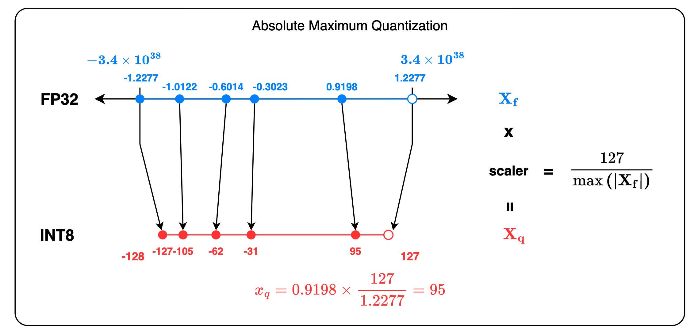

> [!note] Prior Knowledge
> [[Floating-point Numbers]]

## Problem Statement

- [[Bottleneck Analysis#Minimal Memory Requirements]] - reduce memory requirements for LLMs.
- [[Bottleneck Analysis#Important Metrics for LLM Serving]] - increase inference throughput

## Naïve 8-bit Quantization

The intuition behind quantization is to map a high-precision value (e.g., `FP32`) into a low-precision representation, such as `float16`, `bfloat16`, `int16`, `int8`, or even `int4`. 

### Absolute Maximum Quantization

The absmax (abbr. Absolute Maximum) quantization method maps the input tensor $x_f$ to either the minimum or maximum value within the range of the quantized tensor $x_q$. Mathematically, the quantization process is thus defined by,

$$
X_q = \mathrm{round}(\frac{127}{max(|X_f|)}\cdot X_f)\ .
$$

The formula demonstrates that this approach guarantees the full utilization of either the minimum or maximum value within the range of quantization, with the positive maximum value in the tensor mapped to 127 and the negative maximum value mapped to -127. Let us illustrate absolute maximum quantization with a concrete example.

```python
>>> import torch
>>> torch.manual_seed(10)  # reproducible
<torch._C.Generator object at 0x1143f5150>
>>> x_f = torch.randn(10)  # start off by generating a random tensor
tensor([-0.6014, -1.0122, -0.3023, -1.2277,  0.9198])
>>> scaler = 127 / torch.max(torch.abs(x_f))
tensor(103.4466)
>>> x_q = torch.round(scaler * x_f)
tensor([ -62., -105.,  -31., -127.,   95.])
```



Take `INT8` quantization as example. Supposing we have a `FP32` tensor $x_f$ as input and a quantized tensor $x_q$ as output, the transformation or mapping function of quantization thus becomes:

$$
x_q = \mathrm{Round}(s\cdot \mathrm{Clip}(x_f,-r,r)),\ \mathrm{where}\ s=\frac{127}{r}\ .
$$

Due to the symmetry of the lower and upper bound within the range of quantization, `INT8` choose 127 over 128. The *IEEE 754 standard* specifies the range of `FP32` as $[-3.4\times10^{38}, 3.4\times10^{38}]$. In contrast, `INT8` can represent any integer composed by 8 bits, ranging from $-128$ to $127$, 255 evenly distributed numbers. 

### Zero-Point Quantization

The zero-point quantization considers every number in the input tensor as a distribution and tries to reconstruct a new distribution on the entire `INT8` range, i.e., $[-128, 127]$. Mathematically, the quantized tensor $x_f$ is computed by,

$$
\begin{align}
&\mathrm{scaler} = \frac{255}{\max(\mathbf{X})-\min(\mathbf{X})}\\[2ex]
&\mathrm{zeropoint} = -\mathrm{round}(\mathrm{scaler}\cdot \min(\mathbf{X}))-128\\[2ex]
&\mathbf{X}_q = \mathrm{round}\left(\mathrm{scaler}\cdot \mathbf{X} + \mathrm{zeropoint}\right)
\end{align}
$$

Let us refactor the quantized tensor $x_f$ to be represented with only the input tensor $x_f$,

$$
\begin{align}
\mathbf{X}_q &= \mathrm{round}(\mathrm{scaler}\cdot \mathbf{X} + \mathrm{zeropoint})\\[2ex]
&= \mathrm{round}\Big(\mathrm{scaler}\cdot\mathbf{X}-\mathrm{round}\big(\mathrm{scaler}\cdot \min(\mathbf{X})\big)-128\Big)\\[2ex]
&=\mathrm{round}\Big(\mathrm{scaler}\cdot\big(\mathbf{X}-\min\left(\mathbf{X}\right)\big)-128\Big)\\[2ex]
&=\mathrm{round}\Big(\frac{255}{\max(\mathbf{X})-\min(\mathbf{X})}\cdot\big(\mathbf{X}-\min(\mathbf{X})\big)-128\Big)\ .
\end{align}
$$

Apparently, when $x_f$ takes the value of $\max(\mathbf{X})$, $x_q$ equals to $255-128=127$ as its maximum. Likewise, when $x_f$ takes the value of $\min(\mathbf{X})$, $x_q$ equals to $0-128=-128$. As a result, this quantization method takes advantage of the whole range of `INT8`.

```python
>>> torch.manual_seed(10)
>>> x_f = torch.randn(5)
tensor([-0.6014, -1.0122, -0.3023, -1.2277,  0.9198])
>>> scaler = 255 / (torch.max(x_f) - torch.min(x_f))
tensor(118.7419)
>>> zeropoint = -torch.round(scaler * torch.min(x_f)) - 128
tensor(18.)
>>> x_q = torch.clip(torch.round(scaler * x_f + zeropoint), -128, 127)
tensor([ -53., -102.,  -18., -128.,  127.])
```

### Challenges

- Loss of Precision and thus, Accuracy
- Impact on Performance

## LLM Quantization Methods

### Post-Training Quantization

PTQ (abbr. Post-Training Quantization) is a method of training with `FP32` and then converting weights and/or activations to a lower-precision datatypes such as `FP8`, `INT8`, or `INT4`. PTQ quantizes an already-trained model after training as suggested by the name.

PTQ is commonly carried out in two main steps, Calibration and Quantization.

### Static/Dynamic Range Quantization


### Quantization Aware Training

QAT (abbr. Quantization Aware Training)
A method of training for maximizing their accuracy with the quantized datatype.

### Additive Quantization of Language Models

AQLM (abbr. Additive Quantization of Language Models)

### On-the-fly Quantization

OFTQ (abbr. On-the-fly Quantization)

## Modern Quantization Methods

### AWQ

### GGUF

#CPU-GPU-hybrid

### AWQ

### AQLM

### GPTQ

### EXL2