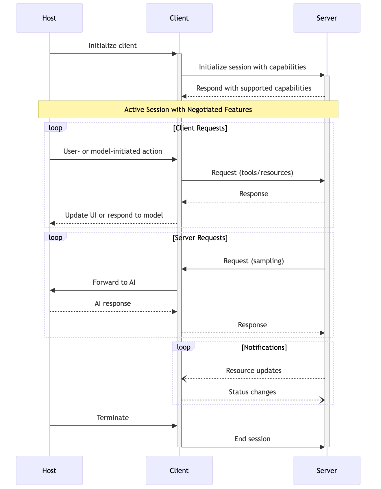
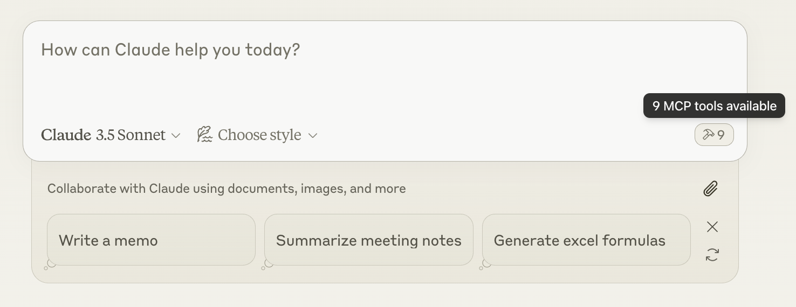

## Problem Statement

Language models are limited to static, text-based reasoning, lack the ability to interact with external systems or perform real-time actions and leave a gap between natural language understanding and actual programmatic execution. This creates a major bottleneck in practical applications where up-to-date information, programmatic execution, or system integration is required. As a result, tasks such as retrieving live data (e.g., weather, stock prices), automating workflows (e.g., booking meetings, sending emails), or executing precise logic (e.g., complex calculations, database queries) become impossible or error-prone, severely restricting the model’s usefulness in real-world scenarios.

## Function Calling

Function calling in large language models (LLMs) is generally structured into four key stages: **Tool Definition**, **Initial Invocation, **Execution and Orchestration**, and **Final Response Generation**.

### Tool Definition

The first step involves defining the helper functions (tools) and providing their schemata as part of the LLM prompt. These definitions include metadata such as function names, descriptions, parameter types, and constraints to ensure structured execution.

```python
# function signature
def func_sig(param1: int, param2: int) -> Any:
    ...
# JSON schema for tool definition
tools = [{
    "type": "function",
    "name": "function_sig",
    "description": "Simple and precicse documentation/comment that describes the functionality of the function",
    "parameters": {
        "type": "object",
        "properties": {
            "param1": {
                "type": "number",
                "description": "what does param1 do if call this",
                # "enum": ["mode1", "mode2", "moden"] # if is enum
            },
            "param2": {"type": "number"},
        },
        "required": ["param1", "param2"],
        "additionalProperties": False
    },
    "strict": True
    },
    {
    "type": "function",
    "name": "function_sig2",
    ...
}]
```

The scheme of tool definition contains following parameters:

| FEILD       | DESCRIPTION                                                                                         |
| ----------- | --------------------------------------------------------------------------------------------------- |
| type        | This should always be "function"                                                                    |
| name        | The function name (e.g., "function_sig" mentioned above)                                            |
| description | Details on when and how to use the function (consider as a prompt to LLM of how to use such a tool) |
| parameters  | Function input parameters                                                                           |
| strict      | Enforce strict mode                                                                                 |

It is often a good practice for LLM to understand and thereby make better decisions by naming functions and parameters precisely as well as using system prompt to describe its functionality and intention more concretely.

### Initial Invocation

After prompting LLMs with our tool definitions and input messages, they can autonomously determine whether to utilize available tools and, if so, identify the necessary arguments for their execution.

```python
input_msgs = [{"role": "user", "content": "prompts blablabla"}]

# take openai as example
from openai import OpenAI
client = OpenAI()
response = client.response.create(model, input=input_msgs, tools=tools)
```

Example of an LLM response:

```json
[{
    "type": "function_call",
    "id": "some_unique_id",
    "call_id": "call_some_unique_id",
    "name": "funcion_sig",
    "arguments": "{\"param1\": 1,\"param2\": 2}"
}]
```

This response indicates that the LLM has generated a `function_call` response, including an `id` and `call_id`, which signifies a decision to invoke `function_name` with the parameters `param1` and `param2` set to 1 and 2, respectively.

> [!note]
> LLMs do not directly execute the function, it relies on executing from an external system and passing the results back.

### Execution and Orchestration

Once the LLM generates a function call, the backend is responsible for executing the specified function and providing feedback.

```python
import json

tool_registry = {}
def register(func):
    tool_registry[func.__name__] = func

@register
def tool1(param1, param2):
    ...

@register
def tool2(param1, param2):
    ...

for tool_call in response.output:
    tool_args = json.loads(tool_call.arguments)
    tool_name = tool_call.name
    result = tool_registry[tool_name](**tool_args)
    # RE-FORMULATE the resquest with results of tool_call
    input_msgs.append(tool_call)
    input_msgs.append({
        "type": "function_call_output",
        "call_id": tool_call.call_id,
        "output": str(result)
    })
```

> [!fail] Limitations
> Unfortunately, LLMs from different vendors such as GPT4o (OpenAI), Gemini (Google) and Claude (Anthropic) formulate the request in different ways, leading to a inconsistency when integrating different LLMs into an application. **Format function calls** will refer to *Formulating Requests and Parsing Responses* in the following.

### Final Response

With the function execution completed, the LLM refines its response based on the tools' output, leading to a more informed and contextually relevant final response.

```python
final_response = client.response.create(model, input=input_msgs, tools=tools)
print(final_response.output_text)
```

### Challenges

Although function calling provides a seamless approach to integrating LLMs into a system, the formatting of function calls varies across different LLMs, requiring distinct prompting strategies. Consequently, developers often engage in redundant and unnecessary work to adapt to these variations.

## Model Contextual Protocol

The **Model Contextual Protocol (MCP)** aims to address the limitations associated with formatting function calls by providing a unified framework that consistently interprets and responds to LLM-generated instructions, thereby reducing the need for model-specific adaptations.

MCP is composed by several important components:

- **MCP Hosts** are AI tools that needs access to external resources, such as Claude Desktop, cline or other AI applications;
- **MCP Clients** are protocol clients adopted by a MCP Hosts, which maintain 1-to-1 connections with servers;
- **MCP Servers** are lightweight systems hosting APIs that expose resources from local data sources or remote services to hosts through MCP;
- **Local Data Source** are files or databases that servers can access and expose;
- **Remote Service** are resources on the internet that servers can connect to;




## MCP Server

Currently, `mcp.server.fastmcp.FastMCP` is the core interface to the MCP protocol. A `FastMCP` server handles the lifespan and message routing automatically. Declare it is as easy as,

```python
from mcp.server.fastmcp import FastMCP

# create a named server
mcp = FastMCP("Application Name", dependencies=["""specify dependencies if any"""])
```

### MCP Primitives

MCP provides three primitives to a server for LLMs to recognize and utilize, **resources**, **tools** and **prompts**, each of which is simply routed by a decorator. The decorator (e.g., `@mcp.tool()`) [registers the function to its corresponding registry](https://github.com/modelcontextprotocol/python-sdk/blob/c2ca8e03e046908935d089a2ceed4e80b0c29a24/src/mcp/server/fastmcp/server.py#L262). Let us explore the usage of them.

#### Resource

A request to a server asking for resource is, simply put, similar to GET endpoints in a REST API. Only does resource is retrieved from the server, and that is it. No heavy computations whatsoever.

```python
@mcp.resource("app://RESOURCE_URI")  # making resource request from named server mcp
def get_user_profile(user_id: str) -> str:
    return f"{table[user_id]}"
```

#### Tool

Tools enable LLMs to utilize pre-defined actions living in a **MCP Server** to interact with the real world. A tool can perform computations, access and modify resources, interact with filesystems, and return structured data.

A `Tool` class contains following class variables:

- `name (str)`: The name of the tool;
- `description (str | None)`: A human-readable description of the tool about how and when to use it;
- `inputSchema (dict[str, Any])`: A JSON schema defining the expected parameters of the tool for LLMs to better understand the intention.

```python
import httpx

@mcp.tool()  # making tool request from named server mcp
def is_prime(n: int):
    """Tell if an integer to be a prime number.
    """
    if n < 2:
        return False
    for i in range(2, int(n**0.5) + 1):
        if n % i == 0:
            return False
    return True

@mcp.tool()
async def fetch_http_request(params):
    async with httpx.AsyncClient() as client:
        response = await client.get(f"{url}")
        return response.text
```

`FastMCP` encapsulate all the metadata information (e.g., is_async, tool description, parameters) through a [class method `from_function`](https://github.com/modelcontextprotocol/python-sdk/blob/c2ca8e03e046908935d089a2ceed4e80b0c29a24/src/mcp/server/fastmcp/tools/base.py#L35). For example, the tool `is_prime` is parsed like:

```json
{
    name: 'is_prime',
    description: 'Tell if an integer to be a prime number.',
    parameters:{
        'properties': {'n': {'title': 'N', 'type': 'integer'}},
        'required': ['n'],
        'title': 'is_primeArguments',
        'type': 'object',
    is_async: False,
    context_kwarg: None
}
```

Therefore, it is a good practice to give a intuitive function name, write a concise docstring about how and why, and provide a type annotated parameters to the tool.

#### Prompt

Prompts are prompt templates that can be rendered with user defined parameters to your server.

```python
from mcp.server.fastmcp.prompts import base

@mcp.prompt()
def job_interview_prompt_template(name: str, job_role: str) -> List[base.Message]:
    base.UserMessage(f"""I want you to act as an interviewer. I will be the candidate and you will ask me the interview questions for the ${job_role} position. I want you to only reply as the interviewer. Do not write all the conversation at once. I want you to only do the interview with me. Ask me the questions and wait for my answers. Do not write explanations. Ask me the questions one by one like an interviewer does and wait for my answers. My first sentence is 'Hi'""")
    base.AssistantMessage(f"Greetings, Mr/Mrs. {name}, please introduce your self")
```

### Running Server

#### Development

```python
# running mcp Inspector to visualize our servers.
mcp dev server.py
mcp dev server.py [n[--with dependencies]]
mcp dev server.py --with-editable .

# or by npx
npx -y @modelcontextprotocol/inspector uv run server.py
```

#### Claude Desktop Integration

```python
mcp install server.py [--name "<Server Name>"]

mcp install server.py [n[-v ENV_VAR=<...>]]
mcp install server.py -f .env
```

#### Direct Execution

Directly execute from a cli requires a main guard.

```python
if __name__ == "__main__":
    mcp.run(transport="stdio")  # or sse
```

```bash
mcp run server.py
```

### Low-level MCP Server

You may see some examples or existing MCP tools that are implemented a bit differently than implementations above. The difference comes from the [low-level Python SDK](https://github.com/modelcontextprotocol/python-sdk/blob/main/src/mcp/server/lowlevel/server.py) invoked by developers. We are adapting to [FastMCP](https://github.com/modelcontextprotocol/python-sdk/blob/main/src/mcp/server/lowlevel/server.py), which is, quoted by the author, *"FastMCP handles all the complex protocol details and server management, so you can focus on building great tools. It's designed to be high-level and Pythonic - in most cases, decorating a function is all you need."*, and it has just been added to the official MCP SDK recently.

Here is usage of low-level MCP servers:

#### Create a Server Instance

We start off building the server by creating a `Server` instance, which is no different from what we have previously done with `FastMCP` server.

```python
from mcp.server import Server
import mcp.types as types


app = Server("my-app")
# similar to our FastMCP server
# fast_app = FastMCP("my-app")
```

#### Define Request Handlers

Subsequently, when defining tools—or more precisely, request handlers in the context of a low-level server—the process diverges depending on the framework. With `FastMCP`, tool definition is streamlined: developers can simply annotate their tool functions using the `@fast_app.tool()` decorator, significantly reducing boilerplate code. In contrast, the low-level `Server` implementation requires tools to be registered explicitly in both the `call_tool` and `list_tools` components. `FastMCP` actually encapsulates the business logic for tool execution of a `Server`. The same applies to prompts and resources.

There are two primary approaches to organizing tool implementations: one involves consolidating all tools within a single handler and using a control structure (e.g., a switch statement) to route calls to the appropriate function;

```python
# Have one handler for all tools
@app.call_tool()
async def handle_tool_call(name: str, 
                           args: dict[str, Any] | None
) -> list[types.TextContent | types.ImageContent]:
    try:
        # switch and redirect to corresponding tool
        if name == "list_tables":
            results = db.execute_query(
                "SELECT name FROM schema WHERE type='table'"
            )
            return [types.TextContent(type="text", text=str(results))]
        elif name == "describe_table":
            if not args or "table_name" not in args:
                raise ValueError("No table_name provided.")
            results = db.execute_query(
                f"PRAGMA table_info({args['table_name']})"
            )
        ...
    except Exception as e:
        return [types.TextContent(type="text", text=f"Error: {str(e)}")]


```

the other adopts a modular design, where each tool is implemented independently, as demonstrated in the `FastMCP` framework.

```python
# more details https://github.com/modelcontextprotocol/python-sdk/blob/c2ca8e03e046908935d089a2ceed4e80b0c29a24/src/mcp/server/lowlevel/server.py#L395
@app.call_tool()
async def list_tables() -> list[types.Tool]:
    ...
@app.call_tool()
async def describe_table() -> list[types.Tool]:
    ...
```

The server exposes its available capabilities to clients via the `list_tools` API endpoint. This endpoint returns a list of tool descriptions, effectively advertising the set of tools that have been implemented and are available for invocation.

```python
@app.list_tools()
async def list_tools() -> list[type.Tool]:
    return [
        types.Tool(
            name="describe_table",
            description="Get the schema information ...",
            inputSchema={
                "type": "object",
                "properties": {
                    "table_name": {"type": "string", "description": "Name of the table to describe"},
                    },
                "required": ["table_name"]
            }
        ),
        types.Tool(
            name="list_tables",
            description="List all tables in the SQLite database",
            inputSchema={
                "type": "object",
                "properties": {},
            },
        )
    ]
```

> [!note]
> Prompts and Resources are very similar to Tools.

#### Define Notification Handlers [if needed]

```python
@app.progress_notification()
async def handle_progress(progress_token: str | int,
                          progress: float,
                          total: float | None
) -> None:
    ...
```

#### Run the Server

```python
async def main():
       async with mcp.server.stdio.stdio_server() as (read_stream, write_stream):
           await server.run(
               read_stream,
               write_stream,
               InitializationOptions(
                   server_name="your_server_name",
                   server_version="your_version",
                   capabilities=server.get_capabilities(
                       notification_options=NotificationOptions(),
                       experimental_capabilities={},
                   ),
               ),
           )
if __name__ == "__main__":
    asyncio.run(main())  # entry point with main guard
```

## MCP Client

A MCP Client is a protocol clients maintaining 1-to-1 connection to a MCP Server. Modern AI Applications, such as [cline](https://github.com/cline/cline.git), hosts their own MCP clients connecting to servers defined by themselves or other [open-source servers](https://mcp.so).

### Claude Desktop

Claude Desktop hosts an pre-built MCP Client. In other words, Claude Desktop can directly runs as many servers as you have on your local filesystems. However, it requires a configuration file at `~/Library/Application Support/Claude/claude_desktop_config.json` (or `%APPDATA%\Claude\claude_desktop_config.json` for Windows platforms) to be able to explore the location of your servers. The configuration file looks like:

```json
{
  "mcpServers": {
    "my-server-name": {
      "command": "uv",
      "args": [
        "--directory",
        "/path/to/your/server",
        "run",
        "my_server.py",
        "[other_args_for_your_script]",
      ]
    }
  }
}
```

After restarting Claude Desktop, we should be able to see a tool 🔨 icon appearing in the input box.



### Custom Client

MCP as a generic contextual protocol for LLMs, it, by all means, supports custom clients that adapt to different demands. Implement a custom client involves four steps: **create the client**, **initialize connection with a server**, **process queries from users** and **start conversation**.

#### Create the Client

```python
import asyncio
from contextlib import AsyncExitStack

from mcp import ClientSession, StdioServerParameters 
from mcp.client.stdio import stdio_client


class MCPClient:
    def __init__(self):
        self.session = None
        self.exit_stack = AsyncExitStack()
        self.tools = None
        self.resources = None
        self.prompts = None
        self.llm = <SomeLLMClient>
```

#### Initialize Connection

```python
class MCPClient:
    async def connect_to_server(self, server_script_path: str):
        """Connect to an MCP server
    
        Args:
            server_script_path: Path to the server script (.py or .js)
        """
        is_python = server_script_path.endswith('.py')
        is_js = server_script_path.endswith('.js')
        if not (is_python or is_js):
            raise ValueError("Server script must be a .py or .js file")
    
        args = []
        if is_python:
            command = "uv"
            args = [
                "--directory",
                "/".join(server_script_path.split("/")[:-1]),
                "run",
                server_script_path.split("/")[-1]
            ]
        else:
            command = "npx"
            args = [
                "-y",
                server_script_path
            ]
        server_params = StdioServerParameters(
            command=command,
            args=args,
            env=None
        )
    
        stdio_transport = await self.exit_stack.enter_async_context(stdio_client(server_params))
        self.stdio, self.write = stdio_transport
        self.session = await self.exit_stack.enter_async_context(ClientSession(self.stdio, self.write))
    
        await self.session.initialize()
    
        # List all capacities owned by a server
        response = await self.session.list_tools()
        self.tools = response.tools
        print("\nConnected to server with tools:", [tool.name for tool in tools])
        response = await self.session.list_resources()
        self.resources = response.resources
        response = await self.session.list_prompts()
        self.prompts = response.prompts


    async def cleanup_server(self):
        await self.exit_stack.aclose()
```

#### Process Query

The method `process_query` is vital, as it contains the logic of how we pass the request and interpret the response back and forth from a LLM.

```python
class MCPClient:
    async def process_query(self, query: str) -> str:
        input_msgs = [{"role": "user", "content": query}]
        response = self.llm(model, messages=input_msgs, tools=self.tools)

        # process and handle results from tool call
        ...
    
```

#### Start Conversation

```python
class MCPClient:
    async def start(self) -> None:
        while True:
            try:
                query = input("You: ").strip()

                if query.lower in ["quit", "exit"]:
                    print("Exiting...")
                    break

                response = await self.process_query(query)
                print("\n" + response)
            except
```

#### Entry Point

```python
async def main():
    client = MCPclient()
    try:
        await client.connect_to_server("<my_server_script>")
        await client.start()
    finally:
        await client.cleanup_server()
```

#### Sampling
